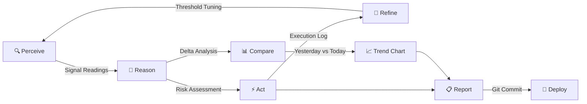
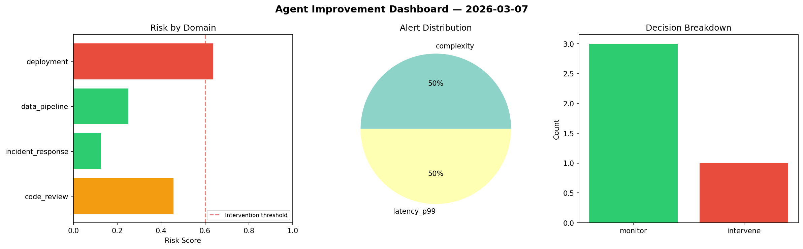

<div align="center">

# 🔄 Agent Improvement

[](https://github.com/Atharv279/agent-improvement/actions/workflows/daily_run.yml)


**Autonomous Perceive → Reason → Act → Refine agent with visual analytics and self-correcting logic.**

</div>

---

## Architecture



## How It Works

| Phase | Description |
|-------|------------|
| **Perceive** | Collects signal readings across 4 operational domains (code review, incident response, data pipeline, deployment) |
| **Reason** | Computes risk scores, identifies alerts, makes intervene/monitor decisions |
| **Act** | Executes mitigation actions for high-risk domains |
| **Refine** | Analyzes historical trends and adjusts decision thresholds |
| **Compare** | Loads yesterday's data and computes deltas for each domain |

## Live Dashboard Preview

> Generated automatically on each run



## Output Structure

```
logs/
├── YYYY-MM-DD.json          # Raw structured data
├── YYYY-MM-DD.md            # Markdown report
├── YYYY-MM-DD_dashboard.png # Risk matrix & alert charts
└── YYYY-MM-DD_trend.png     # 14-day rolling trend
```

## Quick Start

```bash
pip install -r dev-requirements.txt
python main.py
```

## Development

```bash
ruff check main.py           # Lint
mypy main.py --ignore-missing-imports  # Type check
pytest                       # Test
```
