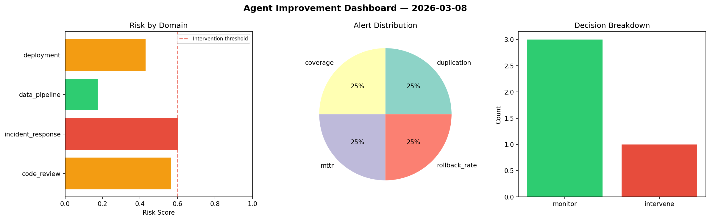
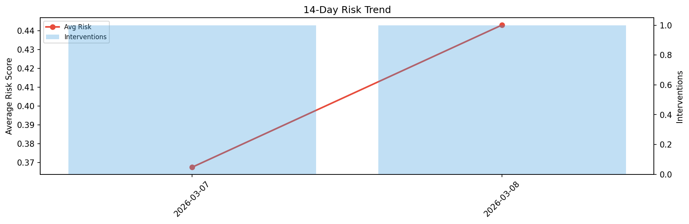

# Agent Improvement Report — 2026-03-08

**Cycle ID:** `70abc149` | **Avg Risk:** 0.4431 | **Interventions:** 1/4

## Risk Matrix

| Domain | Risk Score | Decision | Alerts |
|--------|-----------|----------|--------|
| code_review | 0.5646 | monitor | duplication, coverage |
| incident_response | 0.6039 | intervene | mttr |
| data_pipeline | 0.1742 | monitor | none |
| deployment | 0.4296 | monitor | rollback_rate |

## Delta vs Yesterday

| Domain | Today | Yesterday | Change |
|--------|-------|-----------|--------|
| code_review | 0.5646 | 0.4564 | 📈 23.7% |
| incident_response | 0.6039 | 0.1261 | 📈 378.9% |
| data_pipeline | 0.1742 | 0.2511 | 📉 -30.6% |
| deployment | 0.4296 | 0.637 | 📉 -32.6% |

**Refinement:** `{'adjustment': 'maintain', 'trend': 'improving', 'window': 4}`