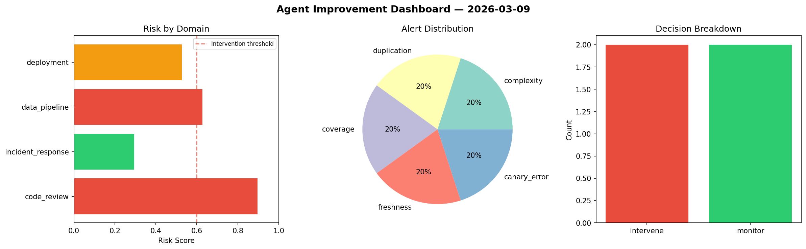
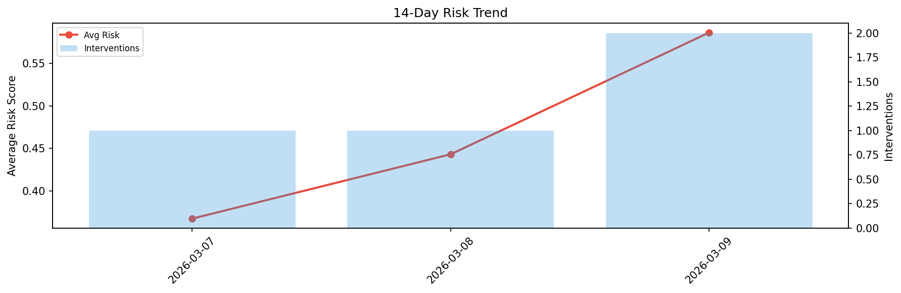

# Agent Improvement Report — 2026-03-09

**Cycle ID:** `ba4d55c9` | **Avg Risk:** 0.5859 | **Interventions:** 2/4

## Risk Matrix

| Domain | Risk Score | Decision | Alerts |
|--------|-----------|----------|--------|
| code_review | 0.8957 | intervene | complexity, duplication, coverage |
| incident_response | 0.2941 | monitor | none |
| data_pipeline | 0.6279 | intervene | freshness |
| deployment | 0.5259 | monitor | canary_error |

## Delta vs Yesterday

| Domain | Today | Yesterday | Change |
|--------|-------|-----------|--------|
| code_review | 0.8957 | 0.5646 | 📈 58.6% |
| incident_response | 0.2941 | 0.6039 | 📉 -51.3% |
| data_pipeline | 0.6279 | 0.1742 | 📈 260.4% |
| deployment | 0.5259 | 0.4296 | 📈 22.4% |

**Refinement:** `{'adjustment': 'maintain', 'trend': 'improving', 'window': 4}`