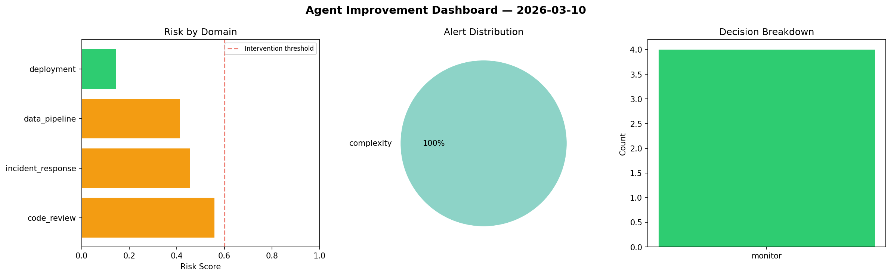
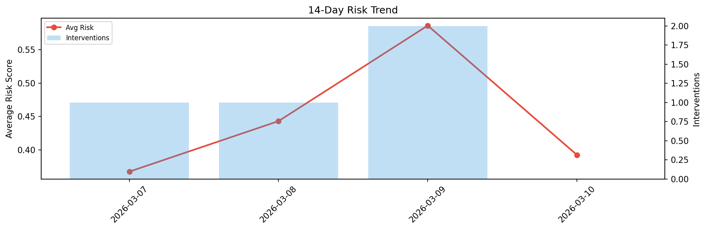

# Agent Improvement Report — 2026-03-10

**Cycle ID:** `f4902c1a` | **Avg Risk:** 0.3926 | **Interventions:** 0/4

## Risk Matrix

| Domain | Risk Score | Decision | Alerts |
|--------|-----------|----------|--------|
| code_review | 0.5584 | monitor | complexity |
| incident_response | 0.4555 | monitor | none |
| data_pipeline | 0.4139 | monitor | none |
| deployment | 0.1428 | monitor | none |

## Delta vs Yesterday

| Domain | Today | Yesterday | Change |
|--------|-------|-----------|--------|
| code_review | 0.5584 | 0.8957 | 📉 -37.7% |
| incident_response | 0.4555 | 0.2941 | 📈 54.9% |
| data_pipeline | 0.4139 | 0.6279 | 📉 -34.1% |
| deployment | 0.1428 | 0.5259 | 📉 -72.8% |

**Refinement:** `{'adjustment': 'maintain', 'trend': 'improving', 'window': 4}`