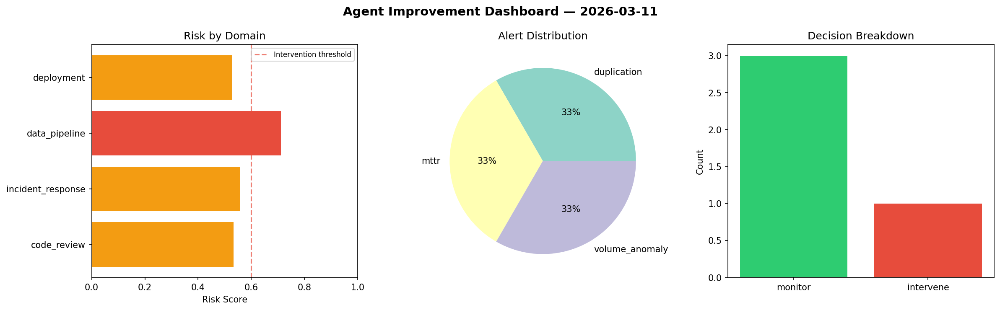
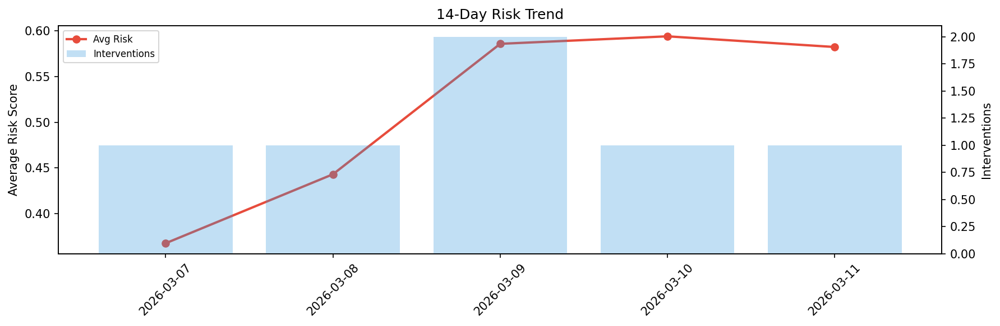

# Agent Improvement Report — 2026-03-11

**Cycle ID:** `1399dc4c` | **Avg Risk:** 0.5824 | **Interventions:** 1/4

## Risk Matrix

| Domain | Risk Score | Decision | Alerts |
|--------|-----------|----------|--------|
| code_review | 0.5337 | monitor | duplication |
| incident_response | 0.5561 | monitor | mttr |
| data_pipeline | 0.712 | intervene | volume_anomaly |
| deployment | 0.5279 | monitor | none |

## Delta vs Yesterday

| Domain | Today | Yesterday | Change |
|--------|-------|-----------|--------|
| code_review | 0.5337 | 0.4385 | 📈 21.7% |
| incident_response | 0.5561 | 0.5311 | 📈 4.7% |
| data_pipeline | 0.712 | 0.5784 | 📈 23.1% |
| deployment | 0.5279 | 0.8283 | 📉 -36.3% |

**Refinement:** `{'adjustment': 'maintain', 'trend': 'improving', 'window': 4}`