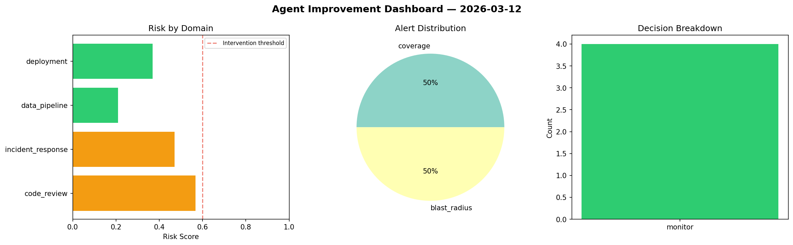
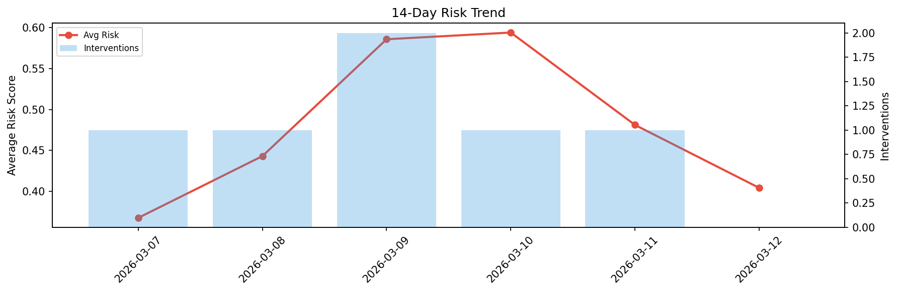

# Agent Improvement Report — 2026-03-12

**Cycle ID:** `2327e1d9` | **Avg Risk:** 0.4043 | **Interventions:** 0/4

## Risk Matrix

| Domain | Risk Score | Decision | Alerts |
|--------|-----------|----------|--------|
| code_review | 0.5677 | monitor | coverage |
| incident_response | 0.47 | monitor | blast_radius |
| data_pipeline | 0.2103 | monitor | none |
| deployment | 0.3691 | monitor | none |

## Delta vs Yesterday

| Domain | Today | Yesterday | Change |
|--------|-------|-----------|--------|
| code_review | 0.5677 | 0.3174 | 📈 78.9% |
| incident_response | 0.47 | 0.5522 | 📉 -14.9% |
| data_pipeline | 0.2103 | 0.6425 | 📉 -67.3% |
| deployment | 0.3691 | 0.4127 | 📉 -10.6% |

**Refinement:** `{'adjustment': 'maintain', 'trend': 'improving', 'window': 4}`