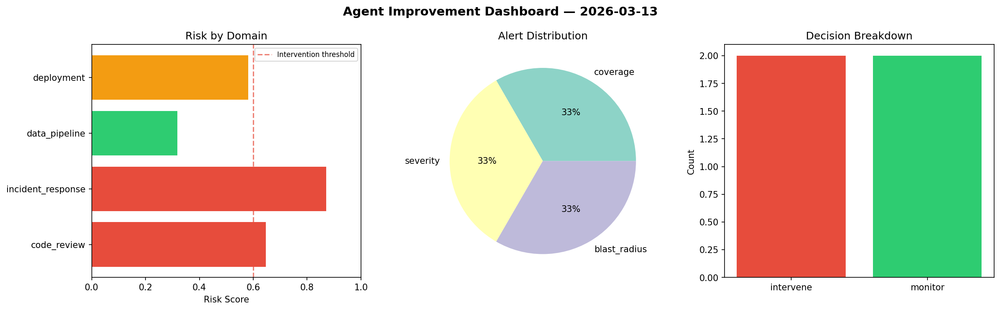
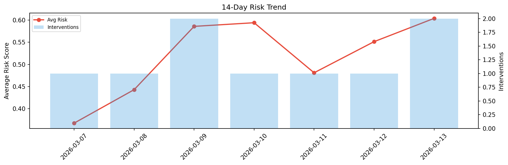

# Agent Improvement Report — 2026-03-13

**Cycle ID:** `82d23b8c` | **Avg Risk:** 0.6039 | **Interventions:** 2/4

## Risk Matrix

| Domain | Risk Score | Decision | Alerts |
|--------|-----------|----------|--------|
| code_review | 0.6461 | intervene | coverage |
| incident_response | 0.8703 | intervene | severity, blast_radius |
| data_pipeline | 0.318 | monitor | none |
| deployment | 0.5812 | monitor | none |

## Delta vs Yesterday

| Domain | Today | Yesterday | Change |
|--------|-------|-----------|--------|
| code_review | 0.6461 | 0.7916 | 📉 -18.4% |
| incident_response | 0.8703 | 0.5762 | 📈 51.0% |
| data_pipeline | 0.318 | 0.4148 | 📉 -23.3% |
| deployment | 0.5812 | 0.4231 | 📈 37.4% |

**Refinement:** `{'adjustment': 'maintain', 'trend': 'improving', 'window': 4}`