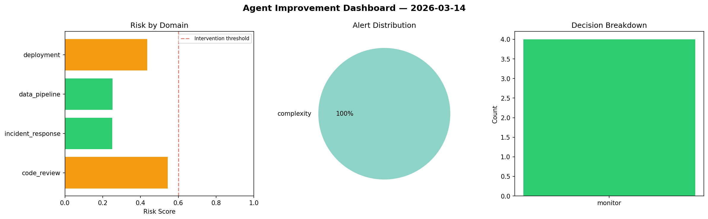
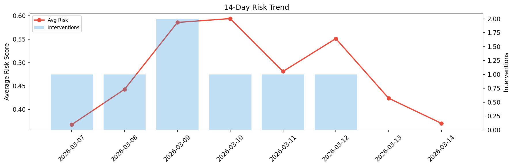

# Agent Improvement Report — 2026-03-14

**Cycle ID:** `0ab1f9ec` | **Avg Risk:** 0.3703 | **Interventions:** 0/4

## Risk Matrix

| Domain | Risk Score | Decision | Alerts |
|--------|-----------|----------|--------|
| code_review | 0.5447 | monitor | complexity |
| incident_response | 0.2504 | monitor | none |
| data_pipeline | 0.2512 | monitor | none |
| deployment | 0.435 | monitor | none |

## Delta vs Yesterday

| Domain | Today | Yesterday | Change |
|--------|-------|-----------|--------|
| code_review | 0.5447 | 0.3781 | 📈 44.1% |
| incident_response | 0.2504 | 0.37 | 📉 -32.3% |
| data_pipeline | 0.2512 | 0.411 | 📉 -38.9% |
| deployment | 0.435 | 0.5368 | 📉 -19.0% |

**Refinement:** `{'adjustment': 'maintain', 'trend': 'improving', 'window': 4}`