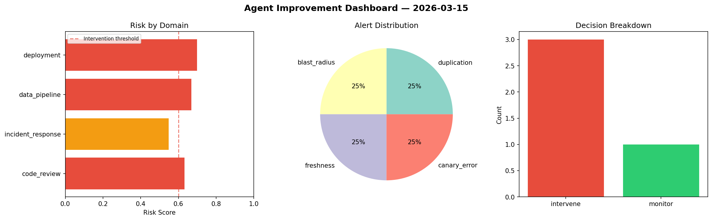
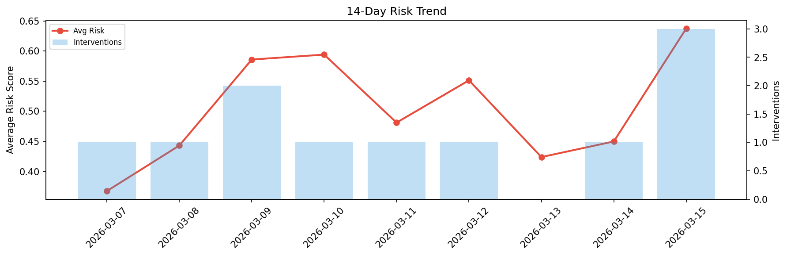

# Agent Improvement Report — 2026-03-15

**Cycle ID:** `8aff3273` | **Avg Risk:** 0.6374 | **Interventions:** 3/4

## Risk Matrix

| Domain | Risk Score | Decision | Alerts |
|--------|-----------|----------|--------|
| code_review | 0.6327 | intervene | duplication |
| incident_response | 0.5491 | monitor | blast_radius |
| data_pipeline | 0.669 | intervene | freshness |
| deployment | 0.6988 | intervene | canary_error |

## Delta vs Yesterday

| Domain | Today | Yesterday | Change |
|--------|-------|-----------|--------|
| code_review | 0.6327 | 0.5117 | 📈 23.6% |
| incident_response | 0.5491 | 0.2326 | 📈 136.1% |
| data_pipeline | 0.669 | 0.6033 | 📈 10.9% |
| deployment | 0.6988 | 0.4519 | 📈 54.6% |

**Refinement:** `{'adjustment': 'tighten_thresholds', 'trend': 'degrading', 'window': 4}`