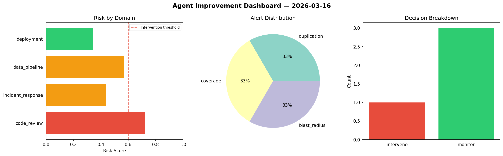
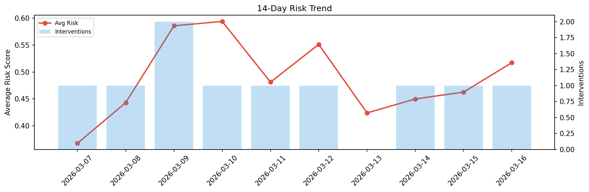

# Agent Improvement Report — 2026-03-16

**Cycle ID:** `700df3a6` | **Avg Risk:** 0.5174 | **Interventions:** 1/4

## Risk Matrix

| Domain | Risk Score | Decision | Alerts |
|--------|-----------|----------|--------|
| code_review | 0.7203 | intervene | duplication, coverage |
| incident_response | 0.4377 | monitor | blast_radius |
| data_pipeline | 0.5678 | monitor | none |
| deployment | 0.3438 | monitor | none |

## Delta vs Yesterday

| Domain | Today | Yesterday | Change |
|--------|-------|-----------|--------|
| code_review | 0.7203 | 0.5611 | 📈 28.4% |
| incident_response | 0.4377 | 0.4452 | 📉 -1.7% |
| data_pipeline | 0.5678 | 0.2173 | 📈 161.3% |
| deployment | 0.3438 | 0.6274 | 📉 -45.2% |

**Refinement:** `{'adjustment': 'maintain', 'trend': 'improving', 'window': 4}`