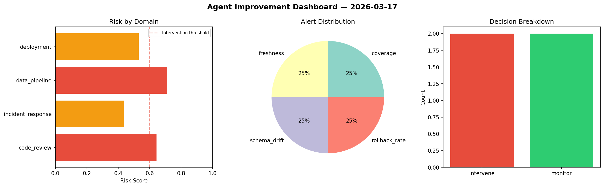
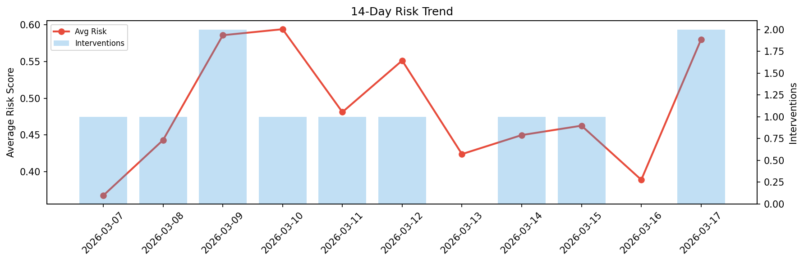

# Agent Improvement Report — 2026-03-17

**Cycle ID:** `b5b64fbc` | **Avg Risk:** 0.5801 | **Interventions:** 2/4

## Risk Matrix

| Domain | Risk Score | Decision | Alerts |
|--------|-----------|----------|--------|
| code_review | 0.6436 | intervene | coverage |
| incident_response | 0.4362 | monitor | none |
| data_pipeline | 0.7104 | intervene | freshness, schema_drift |
| deployment | 0.5302 | monitor | rollback_rate |

## Delta vs Yesterday

| Domain | Today | Yesterday | Change |
|--------|-------|-----------|--------|
| code_review | 0.6436 | 0.5092 | 📈 26.4% |
| incident_response | 0.4362 | 0.2854 | 📈 52.8% |
| data_pipeline | 0.7104 | 0.3543 | 📈 100.5% |
| deployment | 0.5302 | 0.4071 | 📈 30.2% |

**Refinement:** `{'adjustment': 'maintain', 'trend': 'improving', 'window': 4}`