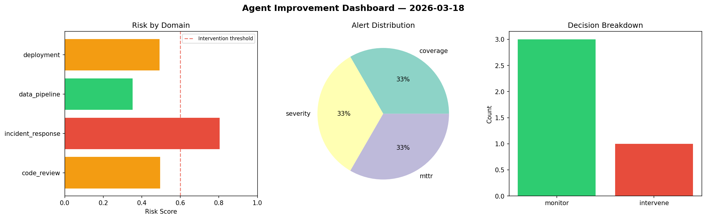
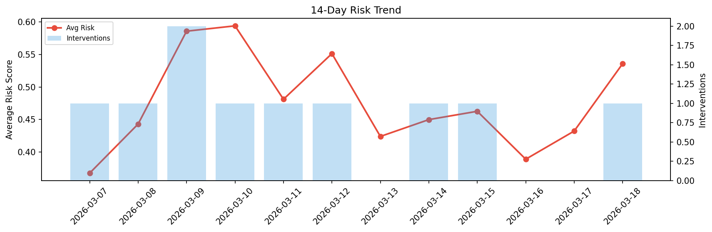

# Agent Improvement Report — 2026-03-18

**Cycle ID:** `d87a46e2` | **Avg Risk:** 0.5359 | **Interventions:** 1/4

## Risk Matrix

| Domain | Risk Score | Decision | Alerts |
|--------|-----------|----------|--------|
| code_review | 0.4952 | monitor | coverage |
| incident_response | 0.8045 | intervene | severity, mttr |
| data_pipeline | 0.3523 | monitor | none |
| deployment | 0.4916 | monitor | none |

## Delta vs Yesterday

| Domain | Today | Yesterday | Change |
|--------|-------|-----------|--------|
| code_review | 0.4952 | 0.5244 | 📉 -5.6% |
| incident_response | 0.8045 | 0.4733 | 📈 70.0% |
| data_pipeline | 0.3523 | 0.4346 | 📉 -18.9% |
| deployment | 0.4916 | 0.2967 | 📈 65.7% |

**Refinement:** `{'adjustment': 'maintain', 'trend': 'improving', 'window': 4}`