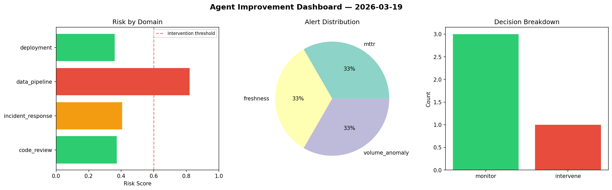
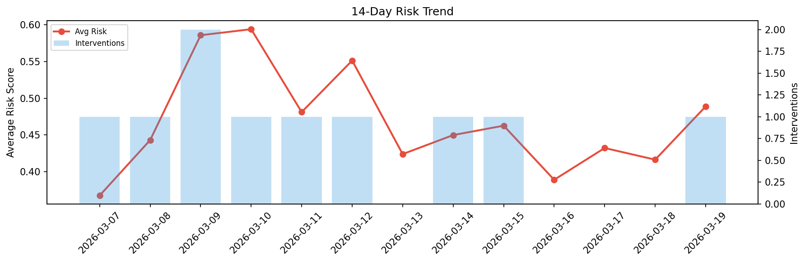

# Agent Improvement Report — 2026-03-19

**Cycle ID:** `ef0afa47` | **Avg Risk:** 0.4889 | **Interventions:** 1/4

## Risk Matrix

| Domain | Risk Score | Decision | Alerts |
|--------|-----------|----------|--------|
| code_review | 0.3718 | monitor | none |
| incident_response | 0.4051 | monitor | mttr |
| data_pipeline | 0.8192 | intervene | freshness, volume_anomaly |
| deployment | 0.3594 | monitor | none |

## Delta vs Yesterday

| Domain | Today | Yesterday | Change |
|--------|-------|-----------|--------|
| code_review | 0.3718 | 0.5184 | 📉 -28.3% |
| incident_response | 0.4051 | 0.1306 | 📈 210.2% |
| data_pipeline | 0.8192 | 0.5184 | 📈 58.0% |
| deployment | 0.3594 | 0.4981 | 📉 -27.8% |

**Refinement:** `{'adjustment': 'maintain', 'trend': 'improving', 'window': 4}`