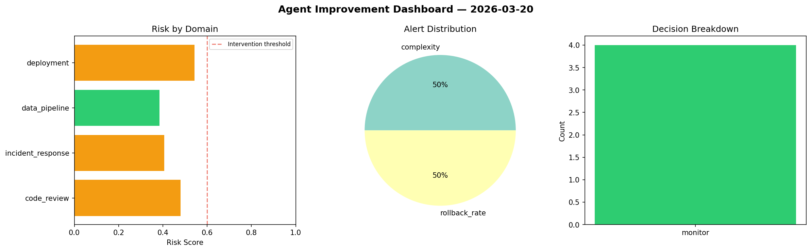
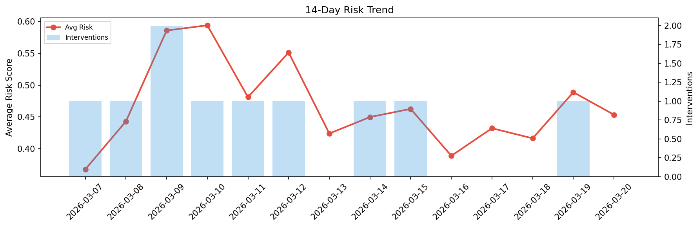

# Agent Improvement Report — 2026-03-20

**Cycle ID:** `4c84509e` | **Avg Risk:** 0.4535 | **Interventions:** 0/4

## Risk Matrix

| Domain | Risk Score | Decision | Alerts |
|--------|-----------|----------|--------|
| code_review | 0.4806 | monitor | complexity |
| incident_response | 0.4064 | monitor | none |
| data_pipeline | 0.3847 | monitor | none |
| deployment | 0.5422 | monitor | rollback_rate |

## Delta vs Yesterday

| Domain | Today | Yesterday | Change |
|--------|-------|-----------|--------|
| code_review | 0.4806 | 0.3718 | 📈 29.3% |
| incident_response | 0.4064 | 0.4051 | 📈 0.3% |
| data_pipeline | 0.3847 | 0.8192 | 📉 -53.0% |
| deployment | 0.5422 | 0.3594 | 📈 50.9% |

**Refinement:** `{'adjustment': 'tighten_thresholds', 'trend': 'degrading', 'window': 4}`