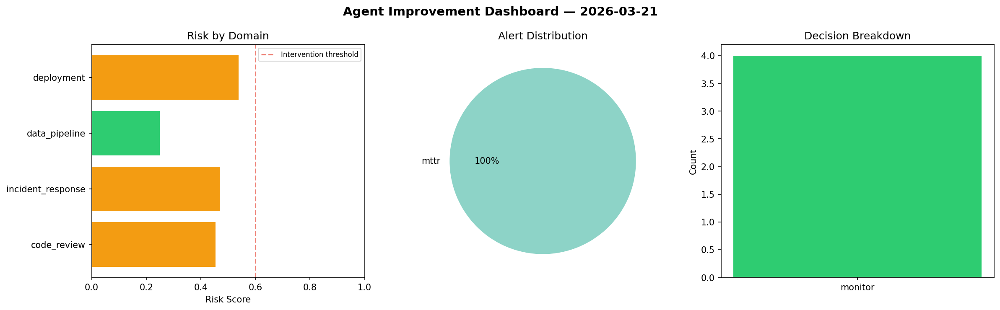
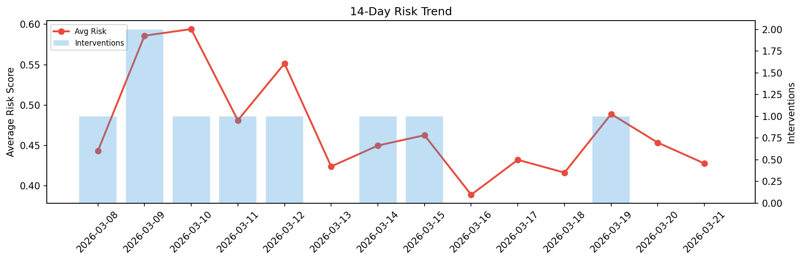

# Agent Improvement Report — 2026-03-21

**Cycle ID:** `3c874086` | **Avg Risk:** 0.4277 | **Interventions:** 0/4

## Risk Matrix

| Domain | Risk Score | Decision | Alerts |
|--------|-----------|----------|--------|
| code_review | 0.453 | monitor | none |
| incident_response | 0.4707 | monitor | mttr |
| data_pipeline | 0.2494 | monitor | none |
| deployment | 0.5378 | monitor | none |

## Delta vs Yesterday

| Domain | Today | Yesterday | Change |
|--------|-------|-----------|--------|
| code_review | 0.453 | 0.4806 | 📉 -5.7% |
| incident_response | 0.4707 | 0.4064 | 📈 15.8% |
| data_pipeline | 0.2494 | 0.3847 | 📉 -35.2% |
| deployment | 0.5378 | 0.5422 | 📉 -0.8% |

**Refinement:** `{'adjustment': 'tighten_thresholds', 'trend': 'degrading', 'window': 4}`