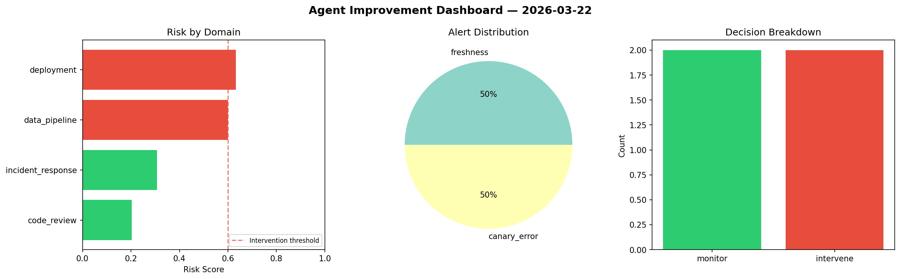
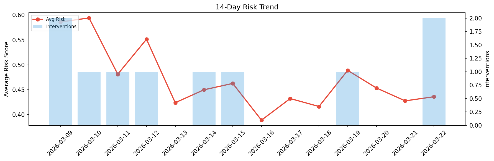

# Agent Improvement Report — 2026-03-22

**Cycle ID:** `70095b9d` | **Avg Risk:** 0.436 | **Interventions:** 2/4

## Risk Matrix

| Domain | Risk Score | Decision | Alerts |
|--------|-----------|----------|--------|
| code_review | 0.2036 | monitor | none |
| incident_response | 0.3076 | monitor | none |
| data_pipeline | 0.6006 | intervene | freshness |
| deployment | 0.6321 | intervene | canary_error |

## Delta vs Yesterday

| Domain | Today | Yesterday | Change |
|--------|-------|-----------|--------|
| code_review | 0.2036 | 0.453 | 📉 -55.1% |
| incident_response | 0.3076 | 0.4707 | 📉 -34.7% |
| data_pipeline | 0.6006 | 0.2494 | 📈 140.8% |
| deployment | 0.6321 | 0.5378 | 📈 17.5% |

**Refinement:** `{'adjustment': 'tighten_thresholds', 'trend': 'degrading', 'window': 4}`