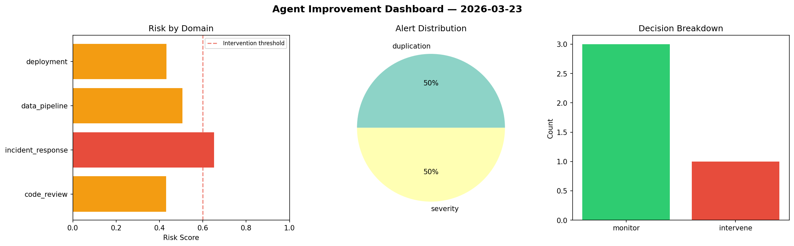
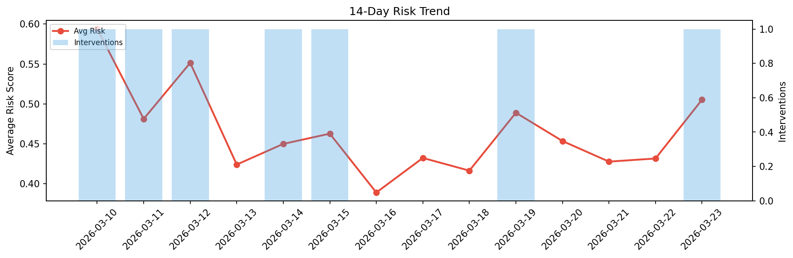

# Agent Improvement Report — 2026-03-23

**Cycle ID:** `3b611858` | **Avg Risk:** 0.5052 | **Interventions:** 1/4

## Risk Matrix

| Domain | Risk Score | Decision | Alerts |
|--------|-----------|----------|--------|
| code_review | 0.4313 | monitor | duplication |
| incident_response | 0.6513 | intervene | severity |
| data_pipeline | 0.5061 | monitor | none |
| deployment | 0.4322 | monitor | none |

## Delta vs Yesterday

| Domain | Today | Yesterday | Change |
|--------|-------|-----------|--------|
| code_review | 0.4313 | 0.5345 | 📉 -19.3% |
| incident_response | 0.6513 | 0.3376 | 📈 92.9% |
| data_pipeline | 0.5061 | 0.3568 | 📈 41.8% |
| deployment | 0.4322 | 0.4977 | 📉 -13.2% |

**Refinement:** `{'adjustment': 'tighten_thresholds', 'trend': 'degrading', 'window': 4}`