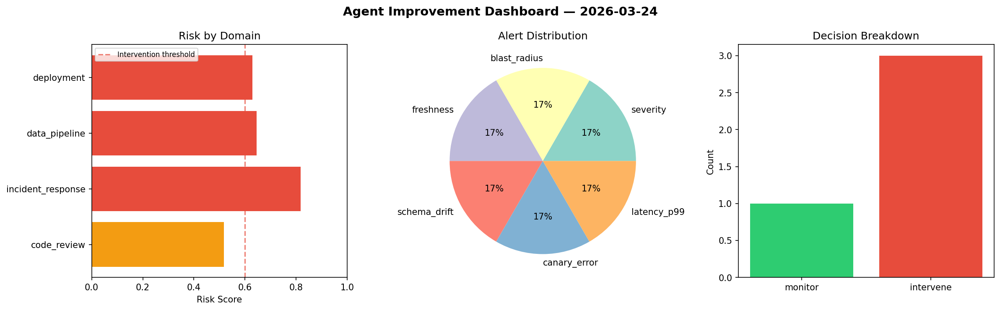
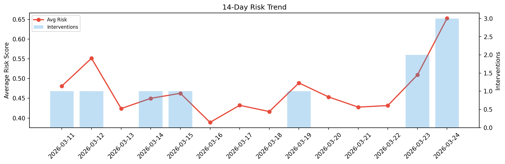

# Agent Improvement Report — 2026-03-24

**Cycle ID:** `4ea6f6cd` | **Avg Risk:** 0.6527 | **Interventions:** 3/4

## Risk Matrix

| Domain | Risk Score | Decision | Alerts |
|--------|-----------|----------|--------|
| code_review | 0.5177 | monitor | none |
| incident_response | 0.8179 | intervene | severity, blast_radius |
| data_pipeline | 0.6461 | intervene | freshness, schema_drift |
| deployment | 0.6291 | intervene | canary_error, latency_p99 |

## Delta vs Yesterday

| Domain | Today | Yesterday | Change |
|--------|-------|-----------|--------|
| code_review | 0.5177 | 0.4489 | 📈 15.3% |
| incident_response | 0.8179 | 0.6761 | 📈 21.0% |
| data_pipeline | 0.6461 | 0.7056 | 📉 -8.4% |
| deployment | 0.6291 | 0.2064 | 📈 204.8% |

**Refinement:** `{'adjustment': 'tighten_thresholds', 'trend': 'degrading', 'window': 4}`