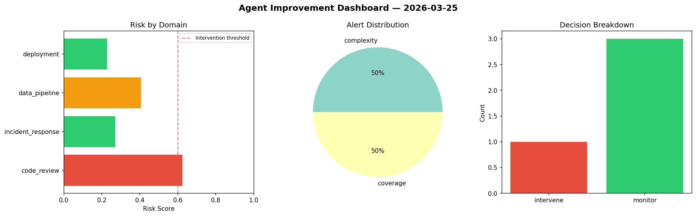
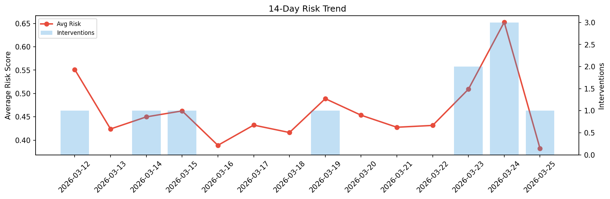

# Agent Improvement Report — 2026-03-25

**Cycle ID:** `6f68cbb9` | **Avg Risk:** 0.3822 | **Interventions:** 1/4

## Risk Matrix

| Domain | Risk Score | Decision | Alerts |
|--------|-----------|----------|--------|
| code_review | 0.6242 | intervene | complexity, coverage |
| incident_response | 0.2706 | monitor | none |
| data_pipeline | 0.4062 | monitor | none |
| deployment | 0.2278 | monitor | none |

## Delta vs Yesterday

| Domain | Today | Yesterday | Change |
|--------|-------|-----------|--------|
| code_review | 0.6242 | 0.5177 | 📈 20.6% |
| incident_response | 0.2706 | 0.8179 | 📉 -66.9% |
| data_pipeline | 0.4062 | 0.6461 | 📉 -37.1% |
| deployment | 0.2278 | 0.6291 | 📉 -63.8% |

**Refinement:** `{'adjustment': 'maintain', 'trend': 'improving', 'window': 4}`