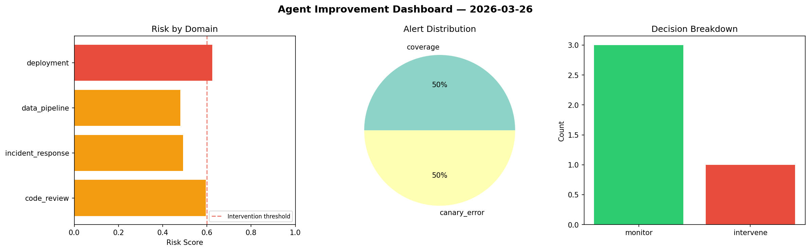
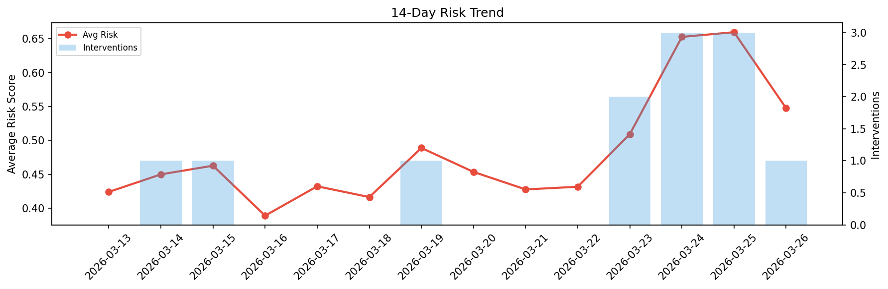

# Agent Improvement Report — 2026-03-26

**Cycle ID:** `edf953cf` | **Avg Risk:** 0.5475 | **Interventions:** 1/4

## Risk Matrix

| Domain | Risk Score | Decision | Alerts |
|--------|-----------|----------|--------|
| code_review | 0.595 | monitor | coverage |
| incident_response | 0.4918 | monitor | none |
| data_pipeline | 0.4792 | monitor | none |
| deployment | 0.6242 | intervene | canary_error |

## Delta vs Yesterday

| Domain | Today | Yesterday | Change |
|--------|-------|-----------|--------|
| code_review | 0.595 | 0.7146 | 📉 -16.7% |
| incident_response | 0.4918 | 0.7299 | 📉 -32.6% |
| data_pipeline | 0.4792 | 0.7167 | 📉 -33.1% |
| deployment | 0.6242 | 0.4773 | 📈 30.8% |

**Refinement:** `{'adjustment': 'tighten_thresholds', 'trend': 'degrading', 'window': 4}`