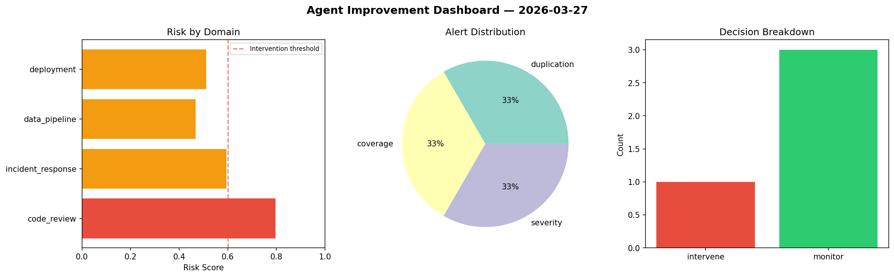
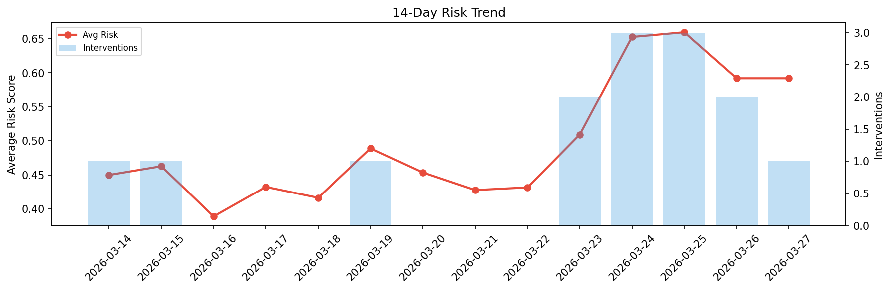

# Agent Improvement Report — 2026-03-27

**Cycle ID:** `c96fbc3e` | **Avg Risk:** 0.5921 | **Interventions:** 1/4

## Risk Matrix

| Domain | Risk Score | Decision | Alerts |
|--------|-----------|----------|--------|
| code_review | 0.7956 | intervene | duplication, coverage |
| incident_response | 0.5941 | monitor | severity |
| data_pipeline | 0.4679 | monitor | none |
| deployment | 0.511 | monitor | none |

## Delta vs Yesterday

| Domain | Today | Yesterday | Change |
|--------|-------|-----------|--------|
| code_review | 0.7956 | 0.6145 | 📈 29.5% |
| incident_response | 0.5941 | 0.4394 | 📈 35.2% |
| data_pipeline | 0.4679 | 0.5357 | 📉 -12.7% |
| deployment | 0.511 | 0.7789 | 📉 -34.4% |

**Refinement:** `{'adjustment': 'maintain', 'trend': 'improving', 'window': 4}`