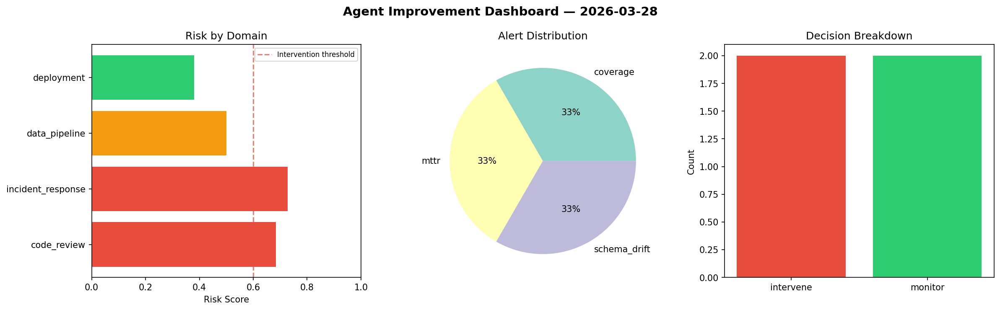
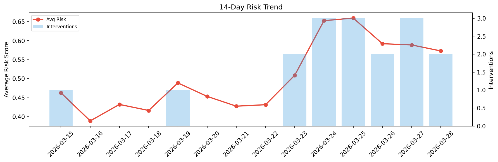

# Agent Improvement Report — 2026-03-28

**Cycle ID:** `7fb0634a` | **Avg Risk:** 0.573 | **Interventions:** 2/4

## Risk Matrix

| Domain | Risk Score | Decision | Alerts |
|--------|-----------|----------|--------|
| code_review | 0.6835 | intervene | coverage |
| incident_response | 0.7274 | intervene | mttr |
| data_pipeline | 0.5009 | monitor | schema_drift |
| deployment | 0.3802 | monitor | none |

## Delta vs Yesterday

| Domain | Today | Yesterday | Change |
|--------|-------|-----------|--------|
| code_review | 0.6835 | 0.6242 | 📈 9.5% |
| incident_response | 0.7274 | 0.6123 | 📈 18.8% |
| data_pipeline | 0.5009 | 0.4755 | 📈 5.3% |
| deployment | 0.3802 | 0.6437 | 📉 -40.9% |

**Refinement:** `{'adjustment': 'maintain', 'trend': 'improving', 'window': 4}`