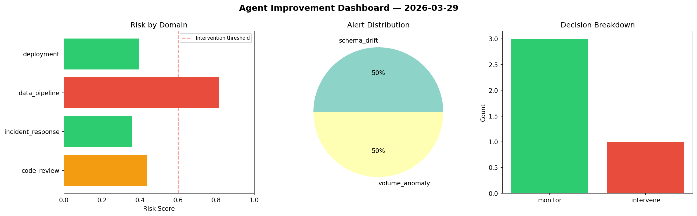
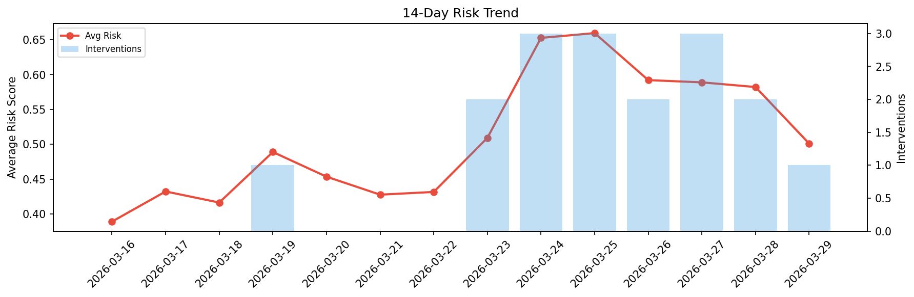

# Agent Improvement Report — 2026-03-29

**Cycle ID:** `96eff6b9` | **Avg Risk:** 0.501 | **Interventions:** 1/4

## Risk Matrix

| Domain | Risk Score | Decision | Alerts |
|--------|-----------|----------|--------|
| code_review | 0.4373 | monitor | none |
| incident_response | 0.3568 | monitor | none |
| data_pipeline | 0.8162 | intervene | schema_drift, volume_anomaly |
| deployment | 0.3935 | monitor | none |

## Delta vs Yesterday

| Domain | Today | Yesterday | Change |
|--------|-------|-----------|--------|
| code_review | 0.4373 | 0.5276 | 📉 -17.1% |
| incident_response | 0.3568 | 0.5439 | 📉 -34.4% |
| data_pipeline | 0.8162 | 0.6187 | 📈 31.9% |
| deployment | 0.3935 | 0.6387 | 📉 -38.4% |

**Refinement:** `{'adjustment': 'maintain', 'trend': 'improving', 'window': 4}`