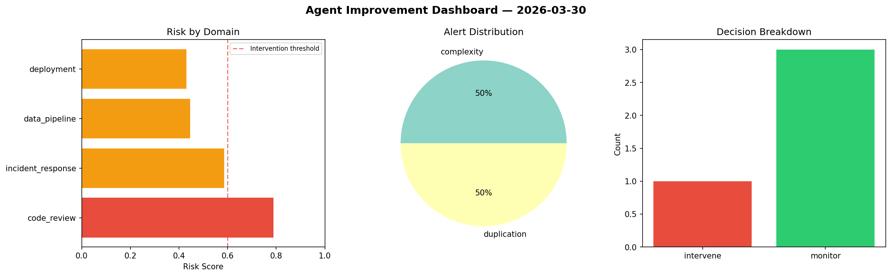
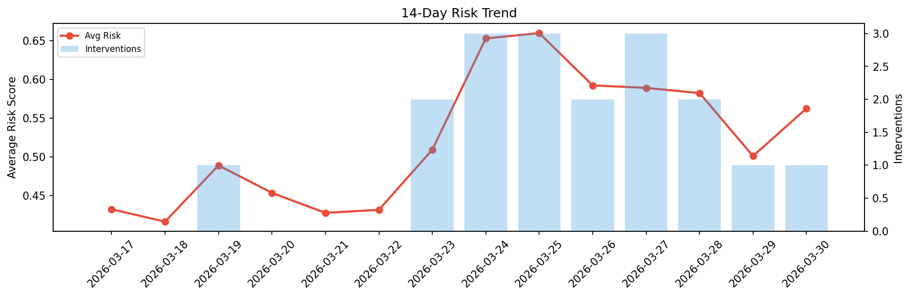

# Agent Improvement Report — 2026-03-30

**Cycle ID:** `74015676` | **Avg Risk:** 0.5624 | **Interventions:** 1/4

## Risk Matrix

| Domain | Risk Score | Decision | Alerts |
|--------|-----------|----------|--------|
| code_review | 0.7883 | intervene | complexity, duplication |
| incident_response | 0.5852 | monitor | none |
| data_pipeline | 0.446 | monitor | none |
| deployment | 0.43 | monitor | none |

## Delta vs Yesterday

| Domain | Today | Yesterday | Change |
|--------|-------|-----------|--------|
| code_review | 0.7883 | 0.4373 | 📈 80.3% |
| incident_response | 0.5852 | 0.3568 | 📈 64.0% |
| data_pipeline | 0.446 | 0.8162 | 📉 -45.4% |
| deployment | 0.43 | 0.3935 | 📈 9.3% |

**Refinement:** `{'adjustment': 'maintain', 'trend': 'improving', 'window': 4}`