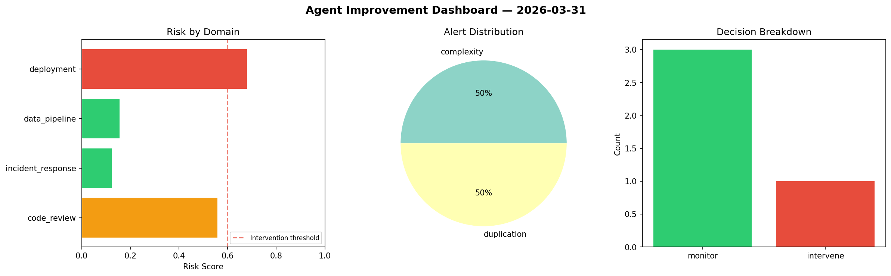
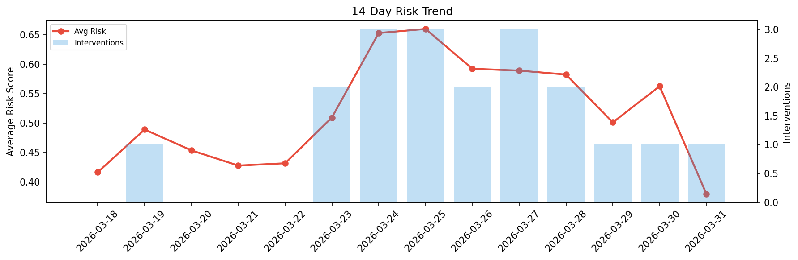

# Agent Improvement Report — 2026-03-31

**Cycle ID:** `9a459270` | **Avg Risk:** 0.3794 | **Interventions:** 1/4

## Risk Matrix

| Domain | Risk Score | Decision | Alerts |
|--------|-----------|----------|--------|
| code_review | 0.5583 | monitor | complexity, duplication |
| incident_response | 0.124 | monitor | none |
| data_pipeline | 0.1555 | monitor | none |
| deployment | 0.6799 | intervene | none |

## Delta vs Yesterday

| Domain | Today | Yesterday | Change |
|--------|-------|-----------|--------|
| code_review | 0.5583 | 0.7883 | 📉 -29.2% |
| incident_response | 0.124 | 0.5852 | 📉 -78.8% |
| data_pipeline | 0.1555 | 0.446 | 📉 -65.1% |
| deployment | 0.6799 | 0.43 | 📈 58.1% |

**Refinement:** `{'adjustment': 'tighten_thresholds', 'trend': 'degrading', 'window': 4}`