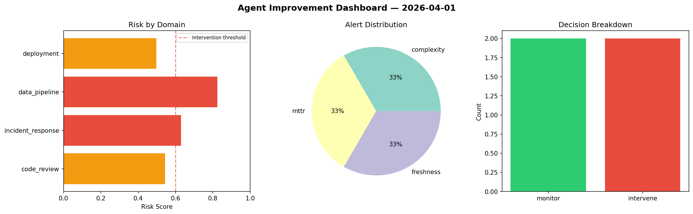
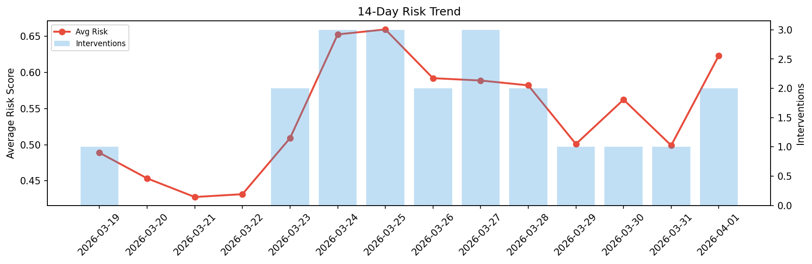

# Agent Improvement Report — 2026-04-01

**Cycle ID:** `32faf58f` | **Avg Risk:** 0.6235 | **Interventions:** 2/4

## Risk Matrix

| Domain | Risk Score | Decision | Alerts |
|--------|-----------|----------|--------|
| code_review | 0.5433 | monitor | complexity |
| incident_response | 0.6289 | intervene | mttr |
| data_pipeline | 0.8243 | intervene | freshness |
| deployment | 0.4976 | monitor | none |

## Delta vs Yesterday

| Domain | Today | Yesterday | Change |
|--------|-------|-----------|--------|
| code_review | 0.5433 | 0.3567 | 📈 52.3% |
| incident_response | 0.6289 | 0.5528 | 📈 13.8% |
| data_pipeline | 0.8243 | 0.673 | 📈 22.5% |
| deployment | 0.4976 | 0.4138 | 📈 20.3% |

**Refinement:** `{'adjustment': 'maintain', 'trend': 'improving', 'window': 4}`