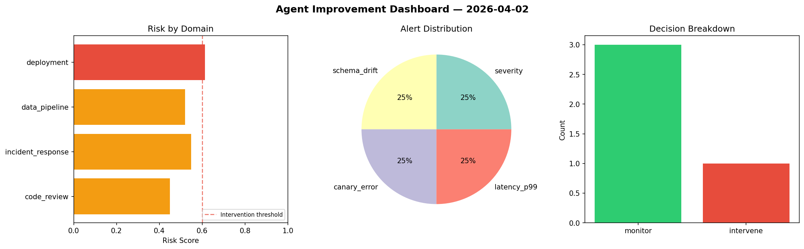
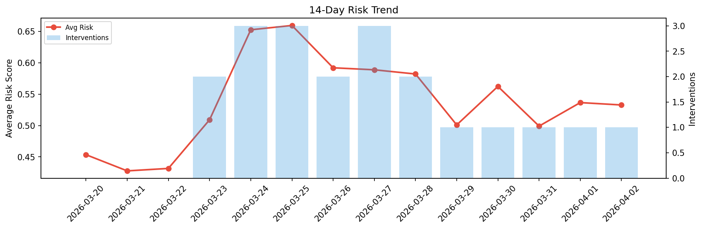

# Agent Improvement Report — 2026-04-02

**Cycle ID:** `7ac19968` | **Avg Risk:** 0.5328 | **Interventions:** 1/4

## Risk Matrix

| Domain | Risk Score | Decision | Alerts |
|--------|-----------|----------|--------|
| code_review | 0.4491 | monitor | none |
| incident_response | 0.5484 | monitor | severity |
| data_pipeline | 0.5209 | monitor | schema_drift |
| deployment | 0.6126 | intervene | canary_error, latency_p99 |

## Delta vs Yesterday

| Domain | Today | Yesterday | Change |
|--------|-------|-----------|--------|
| code_review | 0.4491 | 0.3636 | 📈 23.5% |
| incident_response | 0.5484 | 0.5102 | 📈 7.5% |
| data_pipeline | 0.5209 | 0.5632 | 📉 -7.5% |
| deployment | 0.6126 | 0.7096 | 📉 -13.7% |

**Refinement:** `{'adjustment': 'tighten_thresholds', 'trend': 'degrading', 'window': 4}`