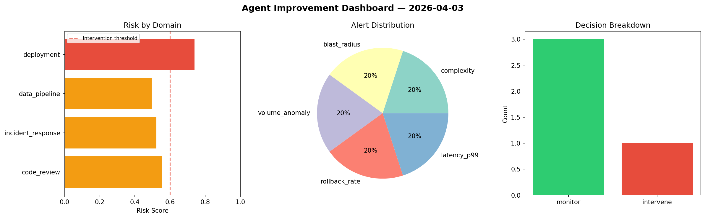
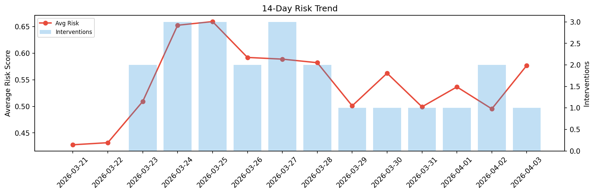

# Agent Improvement Report — 2026-04-03

**Cycle ID:** `be3d6699` | **Avg Risk:** 0.577 | **Interventions:** 1/4

## Risk Matrix

| Domain | Risk Score | Decision | Alerts |
|--------|-----------|----------|--------|
| code_review | 0.5525 | monitor | complexity |
| incident_response | 0.5219 | monitor | blast_radius |
| data_pipeline | 0.4944 | monitor | volume_anomaly |
| deployment | 0.7393 | intervene | rollback_rate, latency_p99 |

## Delta vs Yesterday

| Domain | Today | Yesterday | Change |
|--------|-------|-----------|--------|
| code_review | 0.5525 | 0.147 | 📈 275.9% |
| incident_response | 0.5219 | 0.4747 | 📈 9.9% |
| data_pipeline | 0.4944 | 0.7075 | 📉 -30.1% |
| deployment | 0.7393 | 0.652 | 📈 13.4% |

**Refinement:** `{'adjustment': 'tighten_thresholds', 'trend': 'degrading', 'window': 4}`