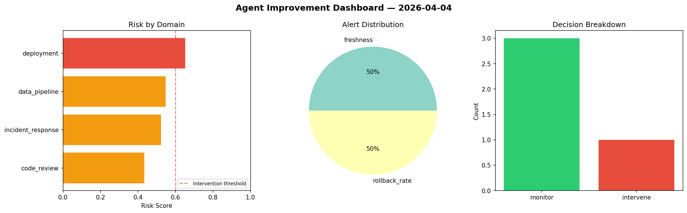
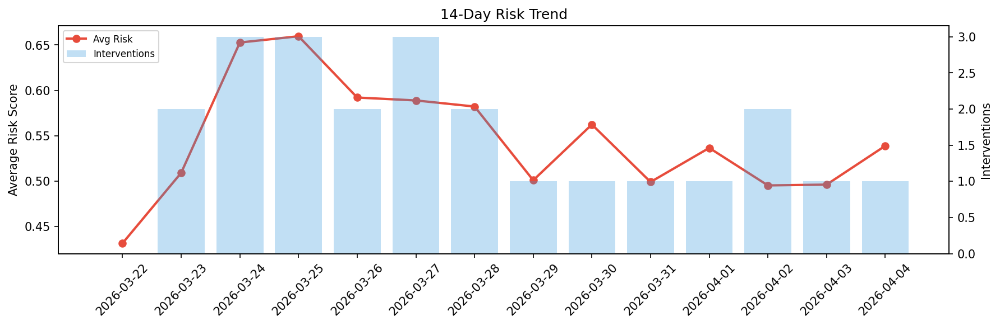

# Agent Improvement Report — 2026-04-04

**Cycle ID:** `8e0b75b2` | **Avg Risk:** 0.5389 | **Interventions:** 1/4

## Risk Matrix

| Domain | Risk Score | Decision | Alerts |
|--------|-----------|----------|--------|
| code_review | 0.4344 | monitor | none |
| incident_response | 0.5225 | monitor | none |
| data_pipeline | 0.5468 | monitor | freshness |
| deployment | 0.6521 | intervene | rollback_rate |

## Delta vs Yesterday

| Domain | Today | Yesterday | Change |
|--------|-------|-----------|--------|
| code_review | 0.4344 | 0.4834 | 📉 -10.1% |
| incident_response | 0.5225 | 0.4126 | 📈 26.6% |
| data_pipeline | 0.5468 | 0.6645 | 📉 -17.7% |
| deployment | 0.6521 | 0.4245 | 📈 53.6% |

**Refinement:** `{'adjustment': 'tighten_thresholds', 'trend': 'degrading', 'window': 4}`