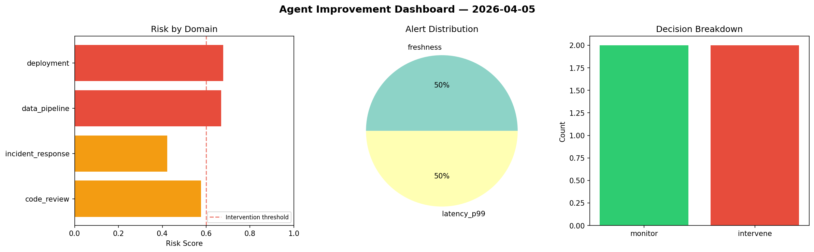
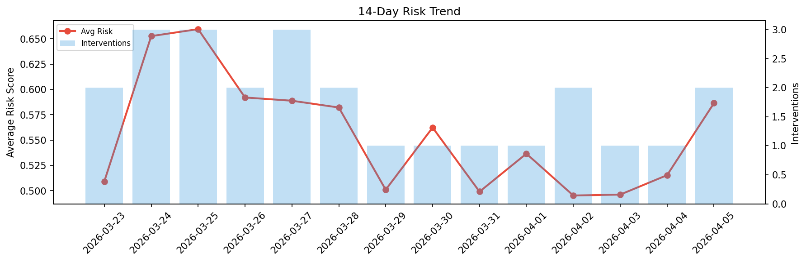

# Agent Improvement Report — 2026-04-05

**Cycle ID:** `5c3b901d` | **Avg Risk:** 0.5866 | **Interventions:** 2/4

## Risk Matrix

| Domain | Risk Score | Decision | Alerts |
|--------|-----------|----------|--------|
| code_review | 0.577 | monitor | none |
| incident_response | 0.4232 | monitor | none |
| data_pipeline | 0.669 | intervene | freshness |
| deployment | 0.6772 | intervene | latency_p99 |

## Delta vs Yesterday

| Domain | Today | Yesterday | Change |
|--------|-------|-----------|--------|
| code_review | 0.577 | 0.4989 | 📈 15.7% |
| incident_response | 0.4232 | 0.368 | 📈 15.0% |
| data_pipeline | 0.669 | 0.5464 | 📈 22.4% |
| deployment | 0.6772 | 0.6484 | 📈 4.4% |

**Refinement:** `{'adjustment': 'tighten_thresholds', 'trend': 'degrading', 'window': 4}`