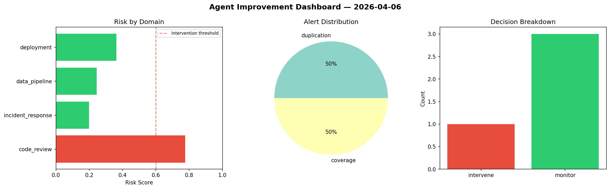
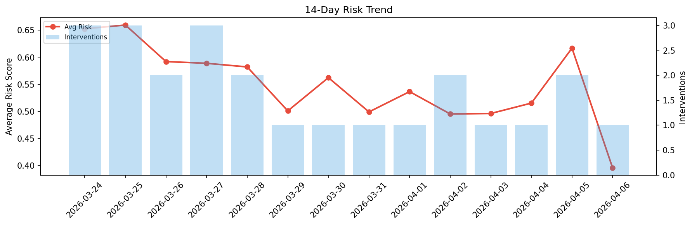

# Agent Improvement Report — 2026-04-06

**Cycle ID:** `26a58a63` | **Avg Risk:** 0.3957 | **Interventions:** 1/4

## Risk Matrix

| Domain | Risk Score | Decision | Alerts |
|--------|-----------|----------|--------|
| code_review | 0.7764 | intervene | duplication, coverage |
| incident_response | 0.1984 | monitor | none |
| data_pipeline | 0.2445 | monitor | none |
| deployment | 0.3633 | monitor | none |

## Delta vs Yesterday

| Domain | Today | Yesterday | Change |
|--------|-------|-----------|--------|
| code_review | 0.7764 | 0.8512 | 📉 -8.8% |
| incident_response | 0.1984 | 0.4143 | 📉 -52.1% |
| data_pipeline | 0.2445 | 0.4271 | 📉 -42.8% |
| deployment | 0.3633 | 0.7749 | 📉 -53.1% |

**Refinement:** `{'adjustment': 'maintain', 'trend': 'improving', 'window': 4}`