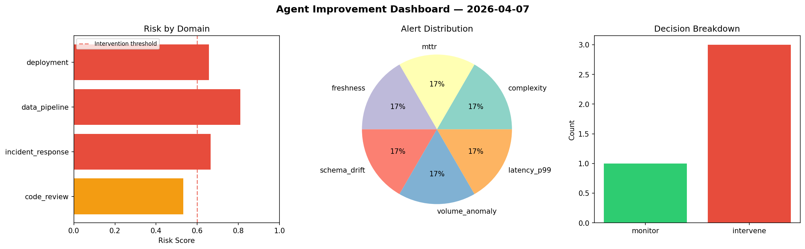
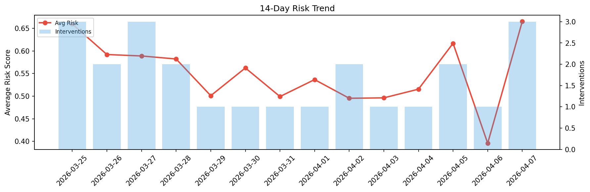

# Agent Improvement Report — 2026-04-07

**Cycle ID:** `a45be895` | **Avg Risk:** 0.6655 | **Interventions:** 3/4

## Risk Matrix

| Domain | Risk Score | Decision | Alerts |
|--------|-----------|----------|--------|
| code_review | 0.5317 | monitor | complexity |
| incident_response | 0.6645 | intervene | mttr |
| data_pipeline | 0.8096 | intervene | freshness, schema_drift, volume_anomaly |
| deployment | 0.6563 | intervene | latency_p99 |

## Delta vs Yesterday

| Domain | Today | Yesterday | Change |
|--------|-------|-----------|--------|
| code_review | 0.5317 | 0.7764 | 📉 -31.5% |
| incident_response | 0.6645 | 0.1984 | 📈 234.9% |
| data_pipeline | 0.8096 | 0.2445 | 📈 231.1% |
| deployment | 0.6563 | 0.3633 | 📈 80.6% |

**Refinement:** `{'adjustment': 'tighten_thresholds', 'trend': 'degrading', 'window': 4}`