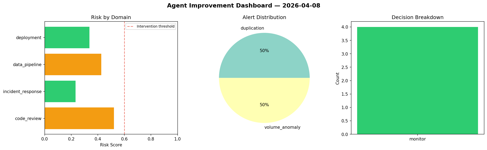
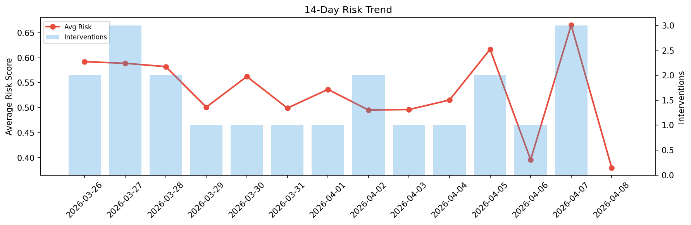

# Agent Improvement Report — 2026-04-08

**Cycle ID:** `67bc8c97` | **Avg Risk:** 0.3794 | **Interventions:** 0/4

## Risk Matrix

| Domain | Risk Score | Decision | Alerts |
|--------|-----------|----------|--------|
| code_review | 0.522 | monitor | duplication |
| incident_response | 0.2328 | monitor | none |
| data_pipeline | 0.4254 | monitor | volume_anomaly |
| deployment | 0.3375 | monitor | none |

## Delta vs Yesterday

| Domain | Today | Yesterday | Change |
|--------|-------|-----------|--------|
| code_review | 0.522 | 0.5317 | 📉 -1.8% |
| incident_response | 0.2328 | 0.6645 | 📉 -65.0% |
| data_pipeline | 0.4254 | 0.8096 | 📉 -47.5% |
| deployment | 0.3375 | 0.6563 | 📉 -48.6% |

**Refinement:** `{'adjustment': 'maintain', 'trend': 'improving', 'window': 4}`