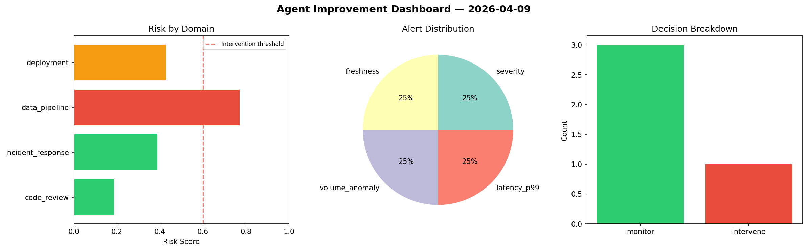
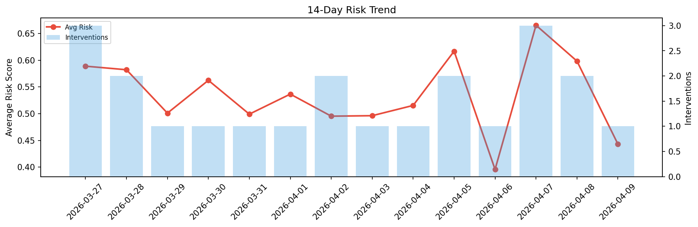

# Agent Improvement Report — 2026-04-09

**Cycle ID:** `7c0167f5` | **Avg Risk:** 0.443 | **Interventions:** 1/4

## Risk Matrix

| Domain | Risk Score | Decision | Alerts |
|--------|-----------|----------|--------|
| code_review | 0.1857 | monitor | none |
| incident_response | 0.3878 | monitor | severity |
| data_pipeline | 0.7703 | intervene | freshness, volume_anomaly |
| deployment | 0.4281 | monitor | latency_p99 |

## Delta vs Yesterday

| Domain | Today | Yesterday | Change |
|--------|-------|-----------|--------|
| code_review | 0.1857 | 0.5131 | 📉 -63.8% |
| incident_response | 0.3878 | 0.7135 | 📉 -45.6% |
| data_pipeline | 0.7703 | 0.776 | 📉 -0.7% |
| deployment | 0.4281 | 0.3908 | 📈 9.5% |

**Refinement:** `{'adjustment': 'tighten_thresholds', 'trend': 'degrading', 'window': 4}`