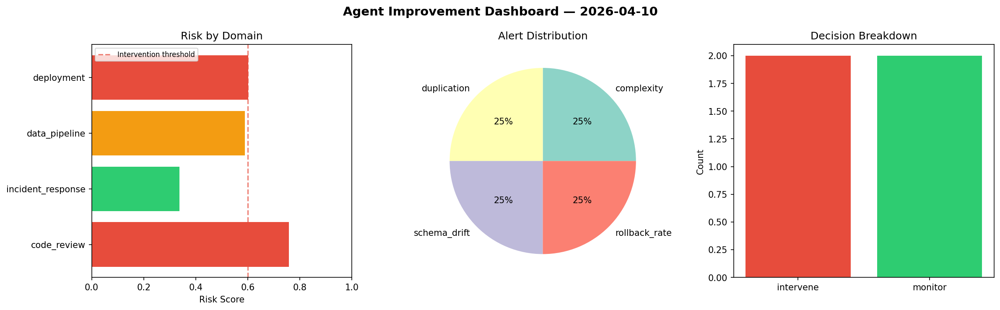
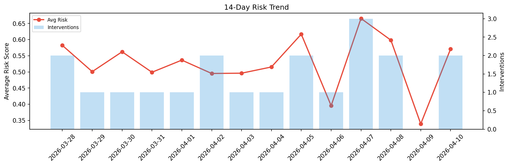

# Agent Improvement Report — 2026-04-10

**Cycle ID:** `88629ea7` | **Avg Risk:** 0.5713 | **Interventions:** 2/4

## Risk Matrix

| Domain | Risk Score | Decision | Alerts |
|--------|-----------|----------|--------|
| code_review | 0.7584 | intervene | complexity, duplication |
| incident_response | 0.3368 | monitor | none |
| data_pipeline | 0.5888 | monitor | schema_drift |
| deployment | 0.601 | intervene | rollback_rate |

## Delta vs Yesterday

| Domain | Today | Yesterday | Change |
|--------|-------|-----------|--------|
| code_review | 0.7584 | 0.3386 | 📈 124.0% |
| incident_response | 0.3368 | 0.4869 | 📉 -30.8% |
| data_pipeline | 0.5888 | 0.2547 | 📈 131.2% |
| deployment | 0.601 | 0.2773 | 📈 116.7% |

**Refinement:** `{'adjustment': 'maintain', 'trend': 'improving', 'window': 4}`