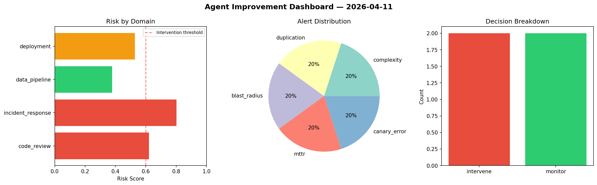
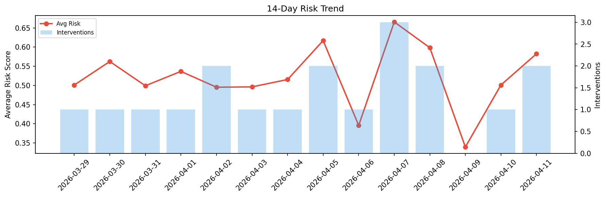

# Agent Improvement Report — 2026-04-11

**Cycle ID:** `18f93f1b` | **Avg Risk:** 0.5825 | **Interventions:** 2/4

## Risk Matrix

| Domain | Risk Score | Decision | Alerts |
|--------|-----------|----------|--------|
| code_review | 0.6206 | intervene | complexity, duplication |
| incident_response | 0.8027 | intervene | blast_radius, mttr |
| data_pipeline | 0.3779 | monitor | none |
| deployment | 0.5287 | monitor | canary_error |

## Delta vs Yesterday

| Domain | Today | Yesterday | Change |
|--------|-------|-----------|--------|
| code_review | 0.6206 | 0.8178 | 📉 -24.1% |
| incident_response | 0.8027 | 0.4451 | 📈 80.3% |
| data_pipeline | 0.3779 | 0.1627 | 📈 132.3% |
| deployment | 0.5287 | 0.5788 | 📉 -8.7% |

**Refinement:** `{'adjustment': 'maintain', 'trend': 'improving', 'window': 4}`