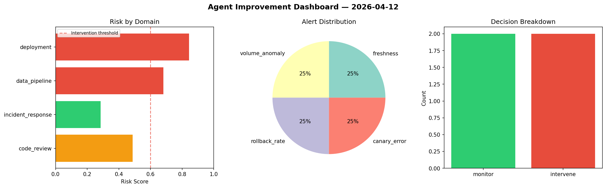
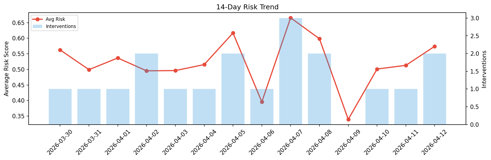

# Agent Improvement Report — 2026-04-12

**Cycle ID:** `22c97df8` | **Avg Risk:** 0.5741 | **Interventions:** 2/4

## Risk Matrix

| Domain | Risk Score | Decision | Alerts |
|--------|-----------|----------|--------|
| code_review | 0.4866 | monitor | none |
| incident_response | 0.285 | monitor | none |
| data_pipeline | 0.6812 | intervene | freshness, volume_anomaly |
| deployment | 0.8436 | intervene | rollback_rate, canary_error |

## Delta vs Yesterday

| Domain | Today | Yesterday | Change |
|--------|-------|-----------|--------|
| code_review | 0.4866 | 0.7976 | 📉 -39.0% |
| incident_response | 0.285 | 0.3569 | 📉 -20.1% |
| data_pipeline | 0.6812 | 0.3915 | 📈 74.0% |
| deployment | 0.8436 | 0.5055 | 📈 66.9% |

**Refinement:** `{'adjustment': 'tighten_thresholds', 'trend': 'degrading', 'window': 4}`