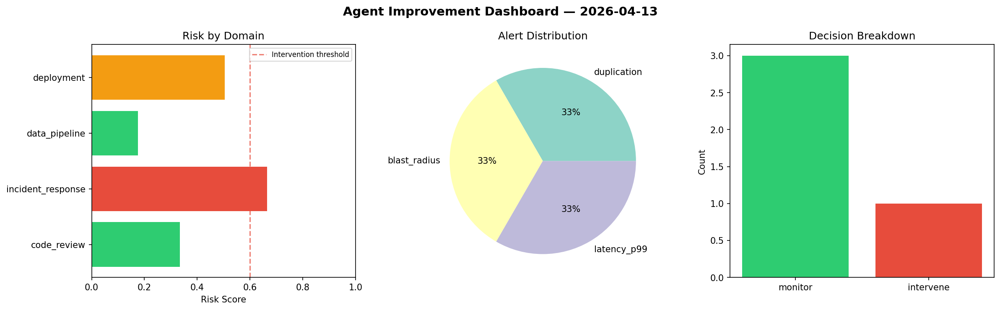
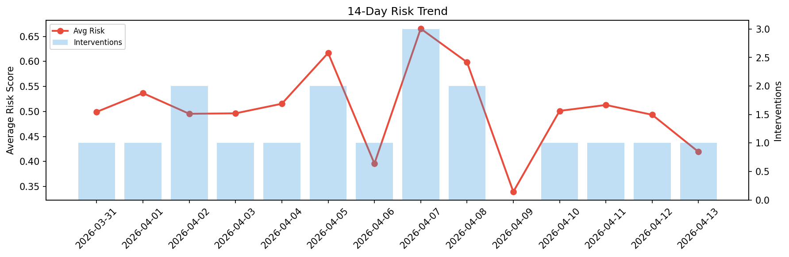

# Agent Improvement Report — 2026-04-13

**Cycle ID:** `d7413f3b` | **Avg Risk:** 0.4192 | **Interventions:** 1/4

## Risk Matrix

| Domain | Risk Score | Decision | Alerts |
|--------|-----------|----------|--------|
| code_review | 0.3339 | monitor | duplication |
| incident_response | 0.6646 | intervene | blast_radius |
| data_pipeline | 0.1747 | monitor | none |
| deployment | 0.5037 | monitor | latency_p99 |

## Delta vs Yesterday

| Domain | Today | Yesterday | Change |
|--------|-------|-----------|--------|
| code_review | 0.3339 | 0.2747 | 📈 21.6% |
| incident_response | 0.6646 | 0.5644 | 📈 17.8% |
| data_pipeline | 0.1747 | 0.741 | 📉 -76.4% |
| deployment | 0.5037 | 0.3932 | 📈 28.1% |

**Refinement:** `{'adjustment': 'tighten_thresholds', 'trend': 'degrading', 'window': 4}`