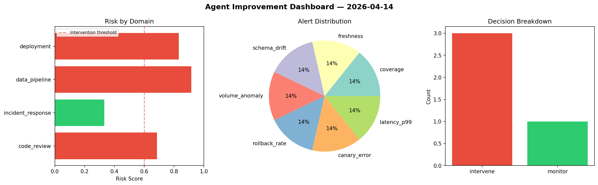
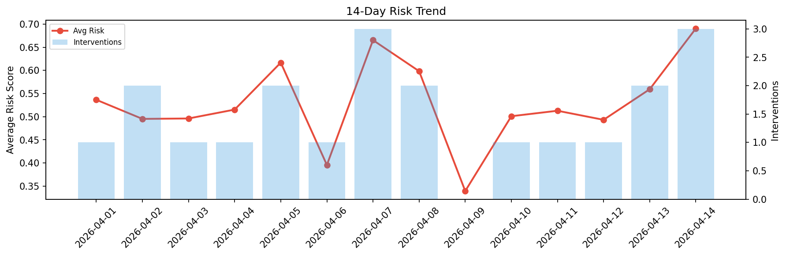

# Agent Improvement Report — 2026-04-14

**Cycle ID:** `2f7ac5e3` | **Avg Risk:** 0.6906 | **Interventions:** 3/4

## Risk Matrix

| Domain | Risk Score | Decision | Alerts |
|--------|-----------|----------|--------|
| code_review | 0.685 | intervene | coverage |
| incident_response | 0.3312 | monitor | none |
| data_pipeline | 0.9147 | intervene | freshness, schema_drift, volume_anomaly |
| deployment | 0.8315 | intervene | rollback_rate, canary_error, latency_p99 |

## Delta vs Yesterday

| Domain | Today | Yesterday | Change |
|--------|-------|-----------|--------|
| code_review | 0.685 | 0.7675 | 📉 -10.7% |
| incident_response | 0.3312 | 0.2677 | 📈 23.7% |
| data_pipeline | 0.9147 | 0.6418 | 📈 42.5% |
| deployment | 0.8315 | 0.5605 | 📈 48.3% |

**Refinement:** `{'adjustment': 'tighten_thresholds', 'trend': 'degrading', 'window': 4}`