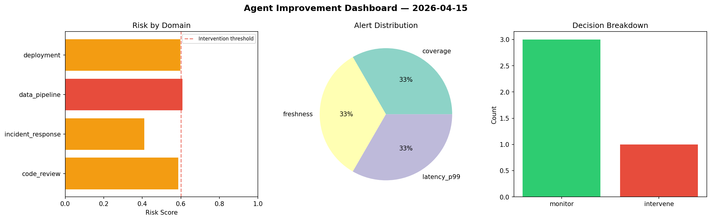
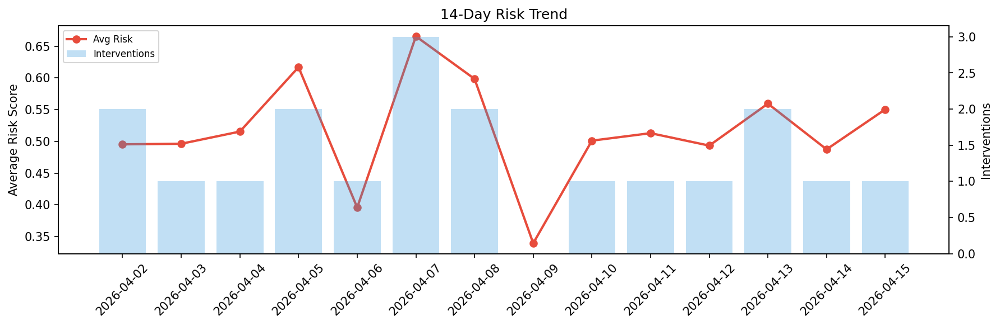

# Agent Improvement Report — 2026-04-15

**Cycle ID:** `c968818f` | **Avg Risk:** 0.5504 | **Interventions:** 1/4

## Risk Matrix

| Domain | Risk Score | Decision | Alerts |
|--------|-----------|----------|--------|
| code_review | 0.586 | monitor | coverage |
| incident_response | 0.4105 | monitor | none |
| data_pipeline | 0.608 | intervene | freshness |
| deployment | 0.5972 | monitor | latency_p99 |

## Delta vs Yesterday

| Domain | Today | Yesterday | Change |
|--------|-------|-----------|--------|
| code_review | 0.586 | 0.7387 | 📉 -20.7% |
| incident_response | 0.4105 | 0.4387 | 📉 -6.4% |
| data_pipeline | 0.608 | 0.353 | 📈 72.2% |
| deployment | 0.5972 | 0.4191 | 📈 42.5% |

**Refinement:** `{'adjustment': 'tighten_thresholds', 'trend': 'degrading', 'window': 4}`