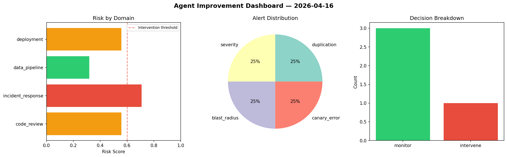
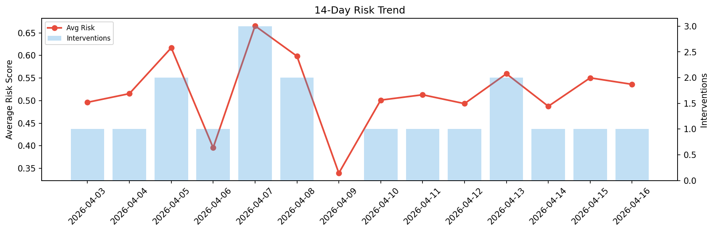

# Agent Improvement Report — 2026-04-16

**Cycle ID:** `c6599f62` | **Avg Risk:** 0.536 | **Interventions:** 1/4

## Risk Matrix

| Domain | Risk Score | Decision | Alerts |
|--------|-----------|----------|--------|
| code_review | 0.5584 | monitor | duplication |
| incident_response | 0.7084 | intervene | severity, blast_radius |
| data_pipeline | 0.3197 | monitor | none |
| deployment | 0.5575 | monitor | canary_error |

## Delta vs Yesterday

| Domain | Today | Yesterday | Change |
|--------|-------|-----------|--------|
| code_review | 0.5584 | 0.586 | 📉 -4.7% |
| incident_response | 0.7084 | 0.4105 | 📈 72.6% |
| data_pipeline | 0.3197 | 0.608 | 📉 -47.4% |
| deployment | 0.5575 | 0.5972 | 📉 -6.6% |

**Refinement:** `{'adjustment': 'maintain', 'trend': 'improving', 'window': 4}`