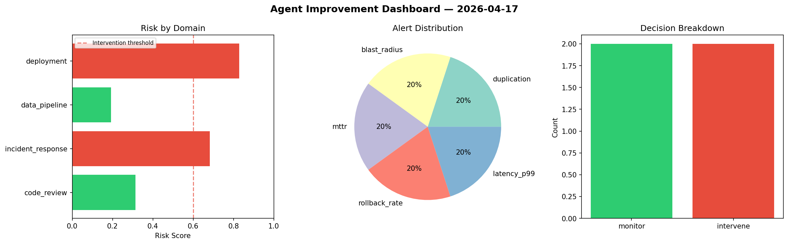
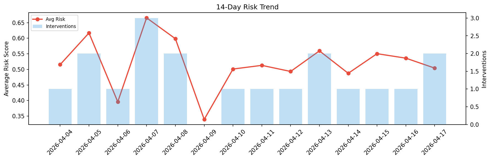

# Agent Improvement Report — 2026-04-17

**Cycle ID:** `c2442efb` | **Avg Risk:** 0.5041 | **Interventions:** 2/4

## Risk Matrix

| Domain | Risk Score | Decision | Alerts |
|--------|-----------|----------|--------|
| code_review | 0.3135 | monitor | duplication |
| incident_response | 0.682 | intervene | blast_radius, mttr |
| data_pipeline | 0.1923 | monitor | none |
| deployment | 0.8285 | intervene | rollback_rate, latency_p99 |

## Delta vs Yesterday

| Domain | Today | Yesterday | Change |
|--------|-------|-----------|--------|
| code_review | 0.3135 | 0.5584 | 📉 -43.9% |
| incident_response | 0.682 | 0.7084 | 📉 -3.7% |
| data_pipeline | 0.1923 | 0.3197 | 📉 -39.8% |
| deployment | 0.8285 | 0.5575 | 📈 48.6% |

**Refinement:** `{'adjustment': 'tighten_thresholds', 'trend': 'degrading', 'window': 4}`