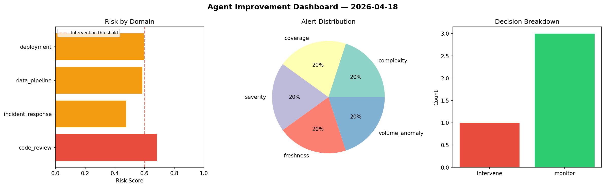
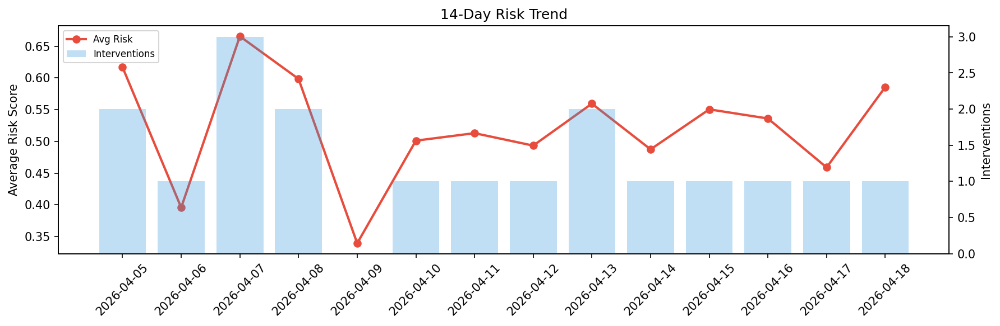

# Agent Improvement Report — 2026-04-18

**Cycle ID:** `b7e78de5` | **Avg Risk:** 0.5856 | **Interventions:** 1/4

## Risk Matrix

| Domain | Risk Score | Decision | Alerts |
|--------|-----------|----------|--------|
| code_review | 0.6845 | intervene | complexity, coverage |
| incident_response | 0.4754 | monitor | severity |
| data_pipeline | 0.586 | monitor | freshness, volume_anomaly |
| deployment | 0.5965 | monitor | none |

## Delta vs Yesterday

| Domain | Today | Yesterday | Change |
|--------|-------|-----------|--------|
| code_review | 0.6845 | 0.6327 | 📈 8.2% |
| incident_response | 0.4754 | 0.3795 | 📈 25.3% |
| data_pipeline | 0.586 | 0.3673 | 📈 59.5% |
| deployment | 0.5965 | 0.4563 | 📈 30.7% |

**Refinement:** `{'adjustment': 'maintain', 'trend': 'improving', 'window': 4}`