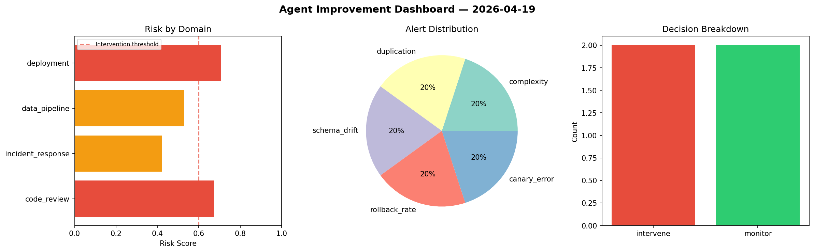
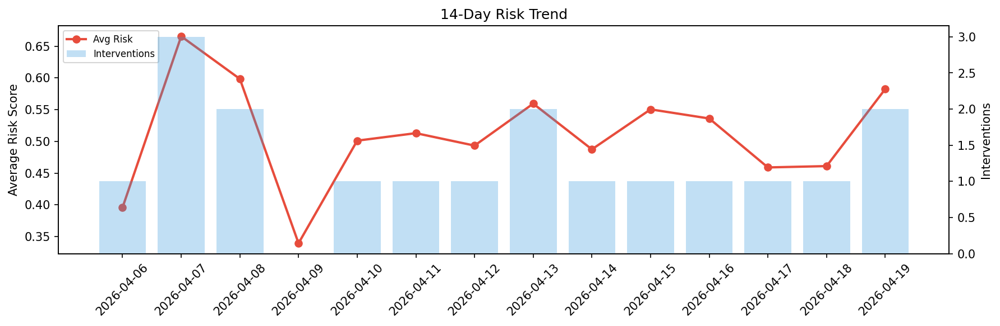

# Agent Improvement Report — 2026-04-19

**Cycle ID:** `5b38e896` | **Avg Risk:** 0.5825 | **Interventions:** 2/4

## Risk Matrix

| Domain | Risk Score | Decision | Alerts |
|--------|-----------|----------|--------|
| code_review | 0.6733 | intervene | complexity, duplication |
| incident_response | 0.4212 | monitor | none |
| data_pipeline | 0.5286 | monitor | schema_drift |
| deployment | 0.7068 | intervene | rollback_rate, canary_error |

## Delta vs Yesterday

| Domain | Today | Yesterday | Change |
|--------|-------|-----------|--------|
| code_review | 0.6733 | 0.363 | 📈 85.5% |
| incident_response | 0.4212 | 0.603 | 📉 -30.1% |
| data_pipeline | 0.5286 | 0.4181 | 📈 26.4% |
| deployment | 0.7068 | 0.4599 | 📈 53.7% |

**Refinement:** `{'adjustment': 'tighten_thresholds', 'trend': 'degrading', 'window': 4}`