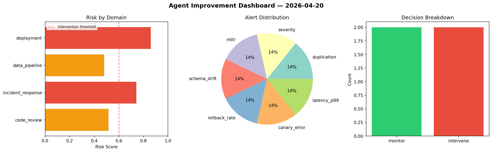
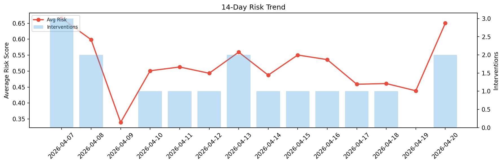

# Agent Improvement Report — 2026-04-20

**Cycle ID:** `94fbce50` | **Avg Risk:** 0.6501 | **Interventions:** 2/4

## Risk Matrix

| Domain | Risk Score | Decision | Alerts |
|--------|-----------|----------|--------|
| code_review | 0.5159 | monitor | duplication |
| incident_response | 0.7429 | intervene | severity, mttr |
| data_pipeline | 0.4805 | monitor | schema_drift |
| deployment | 0.8611 | intervene | rollback_rate, canary_error, latency_p99 |

## Delta vs Yesterday

| Domain | Today | Yesterday | Change |
|--------|-------|-----------|--------|
| code_review | 0.5159 | 0.2312 | 📈 123.1% |
| incident_response | 0.7429 | 0.4425 | 📈 67.9% |
| data_pipeline | 0.4805 | 0.5411 | 📉 -11.2% |
| deployment | 0.8611 | 0.5393 | 📈 59.7% |

**Refinement:** `{'adjustment': 'tighten_thresholds', 'trend': 'degrading', 'window': 4}`