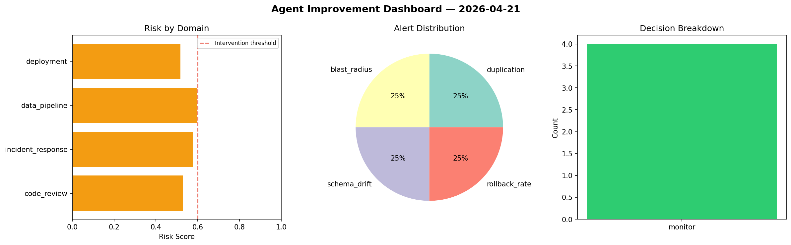
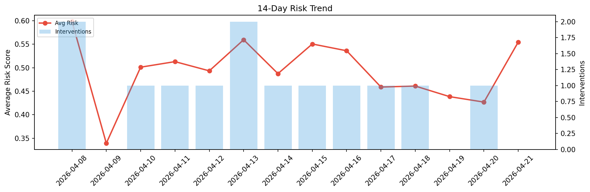

# Agent Improvement Report — 2026-04-21

**Cycle ID:** `b888aaca` | **Avg Risk:** 0.5546 | **Interventions:** 0/4

## Risk Matrix

| Domain | Risk Score | Decision | Alerts |
|--------|-----------|----------|--------|
| code_review | 0.5274 | monitor | duplication |
| incident_response | 0.5753 | monitor | blast_radius |
| data_pipeline | 0.5987 | monitor | schema_drift |
| deployment | 0.5169 | monitor | rollback_rate |

## Delta vs Yesterday

| Domain | Today | Yesterday | Change |
|--------|-------|-----------|--------|
| code_review | 0.5274 | 0.6017 | 📉 -12.3% |
| incident_response | 0.5753 | 0.4793 | 📈 20.0% |
| data_pipeline | 0.5987 | 0.3303 | 📈 81.3% |
| deployment | 0.5169 | 0.2965 | 📈 74.3% |

**Refinement:** `{'adjustment': 'maintain', 'trend': 'improving', 'window': 4}`