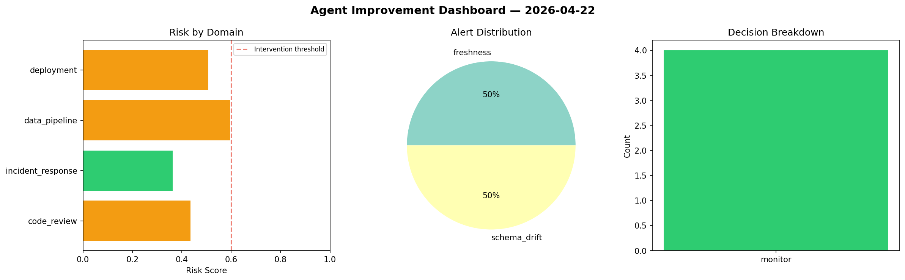
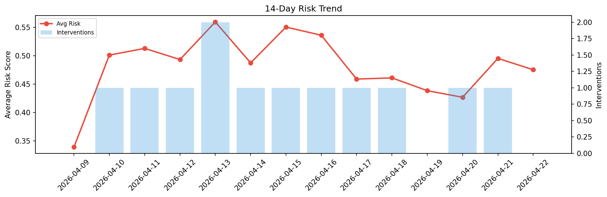

# Agent Improvement Report — 2026-04-22

**Cycle ID:** `094bee72` | **Avg Risk:** 0.4753 | **Interventions:** 0/4

## Risk Matrix

| Domain | Risk Score | Decision | Alerts |
|--------|-----------|----------|--------|
| code_review | 0.4359 | monitor | none |
| incident_response | 0.3632 | monitor | none |
| data_pipeline | 0.5945 | monitor | freshness, schema_drift |
| deployment | 0.5076 | monitor | none |

## Delta vs Yesterday

| Domain | Today | Yesterday | Change |
|--------|-------|-----------|--------|
| code_review | 0.4359 | 0.4449 | 📉 -2.0% |
| incident_response | 0.3632 | 0.7048 | 📉 -48.5% |
| data_pipeline | 0.5945 | 0.4874 | 📈 22.0% |
| deployment | 0.5076 | 0.3441 | 📈 47.5% |

**Refinement:** `{'adjustment': 'tighten_thresholds', 'trend': 'degrading', 'window': 4}`