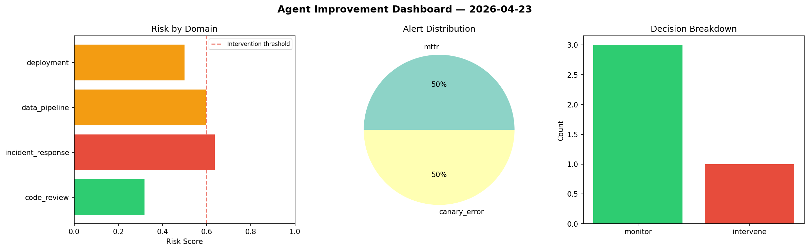
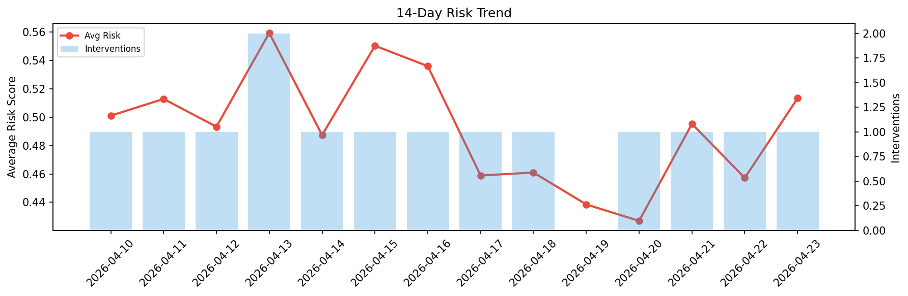

# Agent Improvement Report — 2026-04-23

**Cycle ID:** `fa3d680f` | **Avg Risk:** 0.5134 | **Interventions:** 1/4

## Risk Matrix

| Domain | Risk Score | Decision | Alerts |
|--------|-----------|----------|--------|
| code_review | 0.3193 | monitor | none |
| incident_response | 0.6369 | intervene | mttr |
| data_pipeline | 0.5972 | monitor | none |
| deployment | 0.5002 | monitor | canary_error |

## Delta vs Yesterday

| Domain | Today | Yesterday | Change |
|--------|-------|-----------|--------|
| code_review | 0.3193 | 0.6207 | 📉 -48.6% |
| incident_response | 0.6369 | 0.4591 | 📈 38.7% |
| data_pipeline | 0.5972 | 0.3047 | 📈 96.0% |
| deployment | 0.5002 | 0.4444 | 📈 12.6% |

**Refinement:** `{'adjustment': 'tighten_thresholds', 'trend': 'degrading', 'window': 4}`