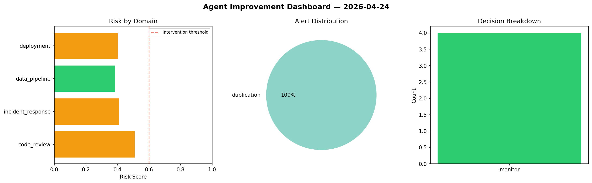
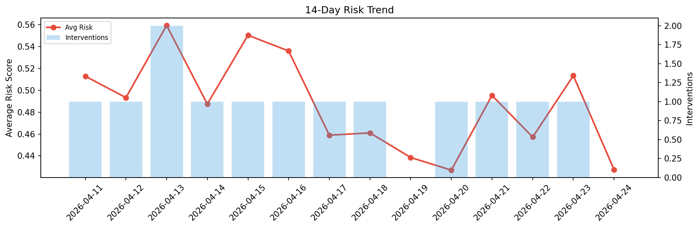

# Agent Improvement Report — 2026-04-24

**Cycle ID:** `07e538d6` | **Avg Risk:** 0.4274 | **Interventions:** 0/4

## Risk Matrix

| Domain | Risk Score | Decision | Alerts |
|--------|-----------|----------|--------|
| code_review | 0.5108 | monitor | duplication |
| incident_response | 0.411 | monitor | none |
| data_pipeline | 0.3851 | monitor | none |
| deployment | 0.4026 | monitor | none |

## Delta vs Yesterday

| Domain | Today | Yesterday | Change |
|--------|-------|-----------|--------|
| code_review | 0.5108 | 0.3193 | 📈 60.0% |
| incident_response | 0.411 | 0.6369 | 📉 -35.5% |
| data_pipeline | 0.3851 | 0.5972 | 📉 -35.5% |
| deployment | 0.4026 | 0.5002 | 📉 -19.5% |

**Refinement:** `{'adjustment': 'maintain', 'trend': 'improving', 'window': 4}`