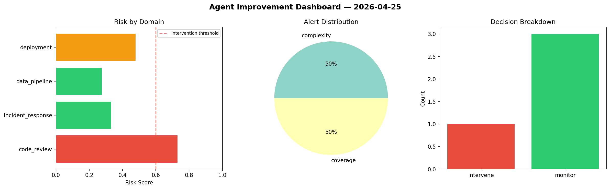
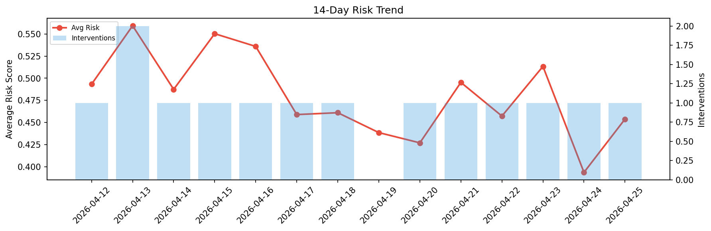

# Agent Improvement Report — 2026-04-25

**Cycle ID:** `b862a2e6` | **Avg Risk:** 0.4538 | **Interventions:** 1/4

## Risk Matrix

| Domain | Risk Score | Decision | Alerts |
|--------|-----------|----------|--------|
| code_review | 0.7302 | intervene | complexity, coverage |
| incident_response | 0.3316 | monitor | none |
| data_pipeline | 0.2749 | monitor | none |
| deployment | 0.4787 | monitor | none |

## Delta vs Yesterday

| Domain | Today | Yesterday | Change |
|--------|-------|-----------|--------|
| code_review | 0.7302 | 0.6301 | 📈 15.9% |
| incident_response | 0.3316 | 0.2648 | 📈 25.2% |
| data_pipeline | 0.2749 | 0.2794 | 📉 -1.6% |
| deployment | 0.4787 | 0.3995 | 📈 19.8% |

**Refinement:** `{'adjustment': 'maintain', 'trend': 'improving', 'window': 4}`